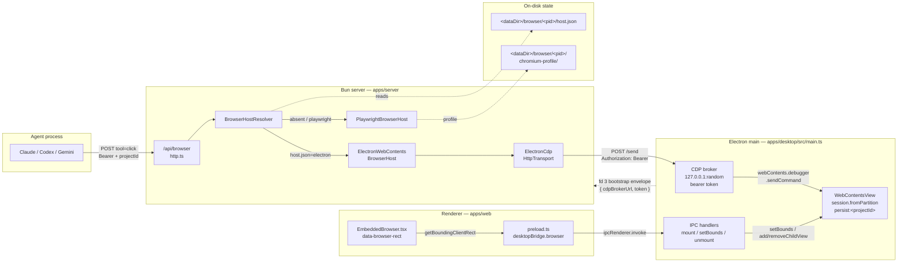
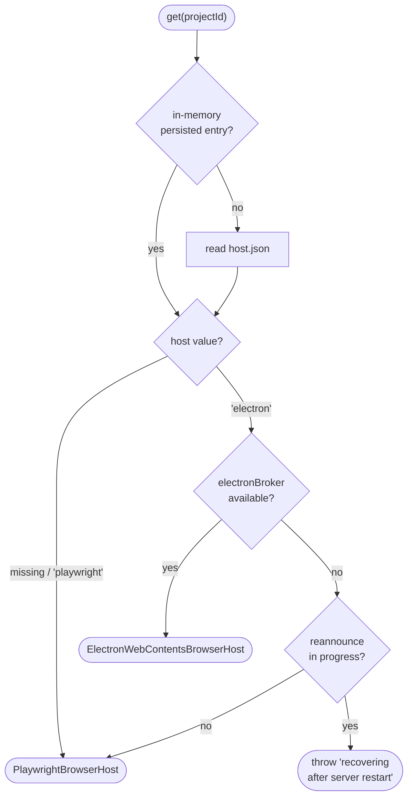
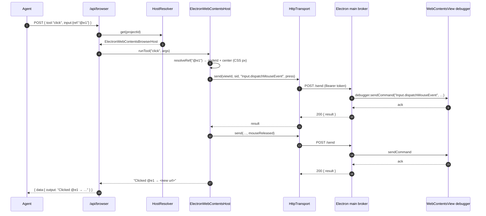
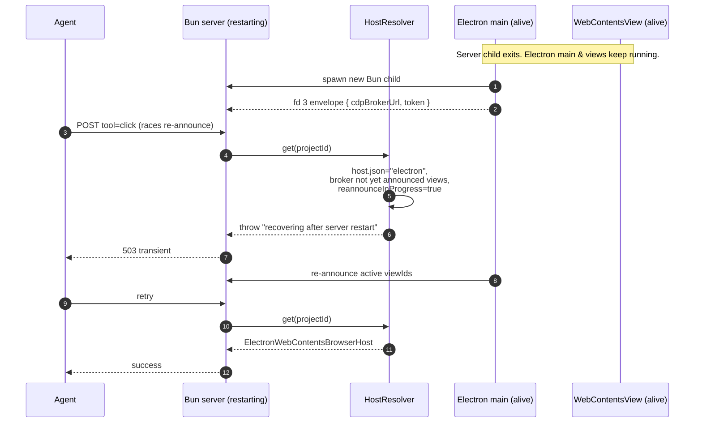
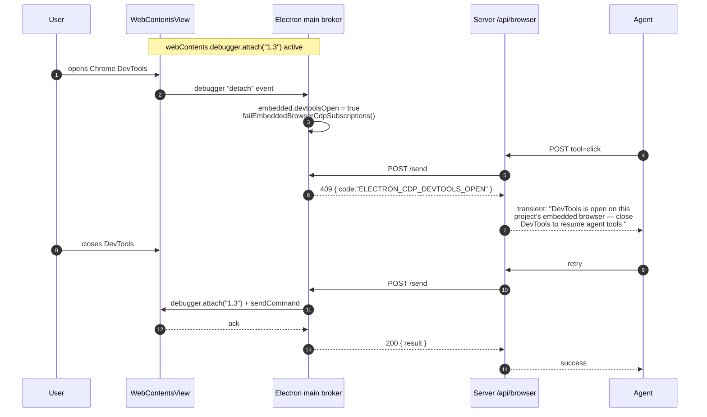

# Browser Automation

In-process Chromium automation exposed to AI sessions via the `/api/browser` REST endpoint. Built by vendoring [GStack Browser](https://github.com/gstack/gstack) (MIT, © Garry Tan) into `apps/server/src/browser/core/` byte-identically, with T3-specific wrappers around it.

See the `NOTICE` file at `apps/server/src/browser/NOTICE` for the full attribution, vendoring approach, and list of intentionally-not-vendored files.

---

## Overview

T3 Code runs Playwright Chromium in-process, keyed by project id. Each project gets its own persistent Chromium profile so cookies, localStorage, and auth sessions survive server restarts and never bleed between projects. Agents drive the browser through plaintext-returning HTTP commands that use stable `@ref` element identifiers from an accessibility snapshot instead of fragile CSS selectors.

Desktop builds also have a native embedded-browser path behind the management-board browser toggle. The renderer owns a URL bar and a `data-browser-rect` sentinel; Electron main mounts a cached `WebContentsView` over that rect, backed by `session.fromPartition("persist:<projectId>")`, and persists `browser/<projectId>/host.json` with `{ "host": "electron" }` on first mount. Toggling away removes the view from the window but keeps its WebContents alive, applies CDP CPU throttling, and pauses media so hidden pages do not keep decoding.

Agent calls reach that same native view through an Electron-main-owned loopback CDP broker. Desktop startup creates a localhost broker with a random bearer token and sends `{ electronCdpBrokerUrl, electronCdpBrokerToken }` to the Bun server in the one-shot bootstrap envelope. The server wraps that endpoint in `CdpBroker`, so `/api/browser` commands for Electron-authoritative projects drive the visible `WebContentsView`; if Chrome DevTools steals `webContents.debugger`, broker calls return the transient DevTools-open error until the debugger reattaches.

| Field                  | Value                                                                       |
| ---------------------- | --------------------------------------------------------------------------- |
| Endpoint               | `/api/browser`                                                              |
| Auth                   | Bearer token (per-thread, `managedRunService.issueMcpAccess`) or dev-bypass |
| Response envelope      | `{ data: { message, data: { output: string } }, error: null }`              |
| Total tools            | 58 (navigate, read, interact, snapshot/screenshot, meta, batch)             |
| Headless host          | Playwright Chromium, `launchPersistentContext`                              |
| Native host            | Electron `WebContentsView` + `webContents.debugger` CDP                     |
| Playwright profile     | `<dataDir>/browser/<projectId>/chromium-profile/`                           |
| Native host assignment | `<dataDir>/browser/<projectId>/host.json`                                   |

## Two Browser Hosts

`/api/browser` resolves one of two hosts per project:

- **Playwright host** — the default for server-only, CI, scheduled-task, and projects that have never mounted the embedded browser. It owns a persistent Playwright Chromium context under `<dataDir>/browser/<projectId>/chromium-profile/`.
- **Electron WebContents host** — active once the desktop app mounts the embedded browser for a project. It drives the exact `WebContentsView` the user sees through an Electron-main-owned CDP broker.

The resolver is deliberately host-sticky. On first native mount, Electron main writes `<dataDir>/browser/<projectId>/host.json` as:

```json
{ "host": "electron" }
```

Server startup reads that file before routing tool calls. This prevents the post-restart race where an early agent call could otherwise fall back to Playwright and see a separate, unauthenticated profile. Closing the board browser toggle hides and throttles the native view, but it does not clear `host.json`; switching back to Playwright requires a future explicit reset/migration flow.

Electron and Playwright profiles are separate Chromium profiles by design. They are not co-opened and should not share a directory because Chromium profile locks and version-stamped schemas make that unsafe.

---

## Call pattern

```bash
# Discover tools
curl -s "${BASE_URL}/api/browser?projectId=${PID}&threadId=${TID}" \
  -H "Authorization: Bearer ${TOKEN}"

# Invoke a tool
curl -s -X POST "${BASE_URL}/api/browser?projectId=${PID}&threadId=${TID}" \
  -H "Authorization: Bearer ${TOKEN}" \
  -H "Content-Type: application/json" \
  -d '{"tool":"goto","input":{"url":"https://example.com"}}'
```

Every successful response wraps the command's plaintext output:

```json
{
  "data": { "message": "OK", "data": { "output": "Navigated to https://example.com (200)" } },
  "error": null
}
```

Errors use the standard T3 shape:

```json
{ "data": null, "error": "Unknown tool: totallyFake" }
```

---

## The `@ref` system

The defining feature vs traditional CSS-selector-based automation. `snapshot` returns the accessibility tree with a stable `@e<N>` (interactive element) or `@c<N>` (cursor-interactive — `cursor:pointer`, `onclick`, `tabindex`) identifier per element. Use those refs in follow-up `click`, `fill`, `hover`, `attrs`, `css`, `is`, `screenshot`, `upload` calls.

Refs are invalidated on navigation — re-call `snapshot` after any `goto`, `click`, or `reload` that changes the page.

```json
// 1. snapshot
{"tool":"snapshot","input":{"interactive":true}}
// → "@e1 [link] \"Learn more\""

// 2. click by ref
{"tool":"click","input":{"ref":"@e1"}}
// → "Clicked @e1 → now at https://www.iana.org/help/example-domains"

// 3. re-snapshot (refs invalidated by navigation)
{"tool":"snapshot","input":{"interactive":true}}
```

CSS selectors still work as a fallback for any command that takes a `ref` or `selector` field, but refs are preferred — they survive minor DOM changes and are deterministic across snapshots.

---

## Command inventory

### Navigate

| Tool                        | Purpose                                    |
| --------------------------- | ------------------------------------------ |
| `goto`                      | Navigate to URL, wait for DOMContentLoaded |
| `back`, `forward`, `reload` | History / reload                           |
| `url`                       | Current URL of active tab                  |

### Read

| Tool                           | Purpose                                                                           |
| ------------------------------ | --------------------------------------------------------------------------------- |
| `text`                         | Cleaned visible text (scripts/styles/svg stripped)                                |
| `html`                         | innerHTML of a selector, or full page HTML                                        |
| `links`                        | All links as `text → href`                                                        |
| `forms`                        | Form fields as JSON (passwords + token-shape values redacted)                     |
| `accessibility`                | Raw ARIA tree (no @refs — use `snapshot` for refs)                                |
| `js` / `evaluate`              | Run JS expression, return result as string                                        |
| `eval`                         | Run JS read from a file (path must be safe)                                       |
| `css`                          | Computed CSS value of property on selector                                        |
| `attrs`                        | All attributes of element as JSON                                                 |
| `is`                           | State check: visible / hidden / enabled / disabled / checked / editable / focused |
| `console`, `network`, `dialog` | Captured console / network / dialog buffers                                       |
| `cookies`, `storage`           | Cookies JSON, localStorage+sessionStorage JSON                                    |
| `perf`                         | Page load timing metrics                                                          |
| `inspect`                      | CDP-driven box model + computed styles + matched rules                            |
| `media`                        | Discover ``, `<video>`, `<audio>`, CSS background-image                      |
| `data`                         | JSON-LD, Open Graph, Twitter Cards, meta tags                                     |

### Interact

| Tool                                                        | Purpose                                                                                            |
| ----------------------------------------------------------- | -------------------------------------------------------------------------------------------------- |
| `click`, `fill`, `hover`, `type`, `press`, `scroll`, `wait` | Standard interactions                                                                              |
| `select`                                                    | Dropdown option by value / label / text                                                            |
| `viewport`                                                  | Set viewport size (e.g. `1024x768`)                                                                |
| `cookie`, `cookie-import`, `cookie-import-browser`          | Cookie management (last reads from installed browsers — Chrome, Edge, Brave, Arc, Chromium, Comet) |
| `header`                                                    | Custom request header on future requests (colon-separated)                                         |
| `useragent`                                                 | Override UA (works on Electron host; broken on Playwright host — see known issues)                 |
| `upload`                                                    | Upload file(s) via `<input type=file>`                                                             |
| `dialog-accept`, `dialog-dismiss`                           | Auto-handle next alert/confirm/prompt                                                              |
| `style`                                                     | Live CSS modification via CDP with undo history                                                    |
| `cleanup`                                                   | Remove ads / cookie banners / overlays / clutter                                                   |
| `prettyscreenshot`                                          | `cleanup --all` + screenshot                                                                       |

### Visual / Meta

| Tool                                | Purpose                                                                                                                                   |
| ----------------------------------- | ----------------------------------------------------------------------------------------------------------------------------------------- |
| `snapshot`                          | Accessibility tree with @refs; supports `interactive`, `compact`, `depth`, `selector`, `diff`, `annotate`, `cursorInteractive`, `heatmap` |
| `screenshot`                        | PNG — full page, viewport, clipped, or element; disk path or base64 data URI                                                              |
| `pdf`                               | Export current page as PDF (Electron host uses `webContents.printToPDF`; Playwright host uses `Page.printToPDF`)                          |
| `responsive`                        | Screenshots at multiple viewport sizes                                                                                                    |
| `diff`                              | Unified text diff vs previous snapshot                                                                                                    |
| `tabs`, `tab`, `newtab`, `closetab` | Tab management                                                                                                                            |
| `focus`                             | Bring browser window to front (headed mode only)                                                                                          |
| `status`                            | Connection mode, tab count, active URL                                                                                                    |
| `ux-audit`                          | Heuristic UX/accessibility audit                                                                                                          |

### Batch

`batch` runs up to 50 of the above sequentially in one request. Each entry is `{ tool, input }` — same shape as a top-level POST. Nested `batch` is rejected. Per-entry errors surface as `[N] toolName ERROR: ...` lines in combined output; the overall request still resolves successfully so agents can inspect partial progress.

### Native Day-1 vs Deferred

The Electron host implements the day-1 native surface for navigation, core read commands, core interactions, snapshot/ref commands, screenshots/PDF, tabs, cookies/storage, headers, console/network/dialog buffers, style/cleanup, and status/UX audit.

Three tools are intentionally deferred in native mode and return the standard parity message:

| Tool                    | Reason deferred                                                                                  |
| ----------------------- | ------------------------------------------------------------------------------------------------ |
| `eval`                  | Depends on reading and executing a local file through the Playwright-oriented handler path.      |
| `cookie-import-browser` | Imports cookies from external installed browsers into a Playwright context; needs native review. |
| `responsive`            | Produces multiple viewport screenshots and needs native bounds/DPR-specific behavior.            |

Two tools are permanently unsupported in the embedded host:

| Tool         | Native behavior                                                                                   |
| ------------ | ------------------------------------------------------------------------------------------------- |
| `focus`      | Not meaningful because the native browser already lives inside the Electron app window.           |
| `visibility` | Playwright-only layer command; embedded visibility is controlled by the renderer bounds protocol. |

---

## Architecture

### Cross-process wiring

Four processes cooperate. The renderer owns the browser's on-screen rect; Electron main owns the `WebContentsView` and the CDP broker; the Bun server translates `/api/browser` tool calls into CDP commands; the agent process drives tools over HTTP.



The broker URL and bearer token are generated at Electron startup (`apps/desktop/src/main.ts` — `startBrowserCdpBrokerServer`) and delivered to the Bun child on fd 3 as part of the one-shot bootstrap envelope. The server builds `ElectronCdpHttpTransport` from that URL/token and never talks to Electron any other way. See [browser-transport-decision.md](./browser-transport-decision.md) for why this is an HTTP loopback and not fd framing or `utilityProcess`.

### Server-side dispatch

```
apps/server/src/browser/http.ts            — REST handler, auth, { tool, input } parse
apps/server/src/browser/handlers.ts        — table-driven SPECS, argsFromInput → string[]
apps/server/src/browser/BrowserHostResolver.ts
   │  host.json absent / "playwright" → PlaywrightBrowserHost
   │  host.json "electron"            → ElectronWebContentsBrowserHost
   ▼
BrowserHost.runTool(...)
   ├─ PlaywrightBrowserHost          → BrowserManager → vendored gstack core → Playwright Chromium
   └─ ElectronWebContentsBrowserHost → CdpBroker → Electron main → WebContentsView
```

### Host resolution

`BrowserHostResolver.get(projectId)` picks a host per call. It is host-sticky: once a project is marked `electron`, it stays that way across restarts, even if the broker has not re-announced views yet (that case returns a transient "recovering" error instead of silently falling back to Playwright on a separate profile).



Implementation: `apps/server/src/browser/BrowserHostResolver.ts` (`get` at line 153, `parseHostJson` at line 63). `host.json` is written by `persistElectronHost` the first time a project mounts the native view.

### Bounds protocol (renderer ↔ main)

The renderer is the source of truth for the browser's on-screen rect. `EmbeddedBrowser.tsx` renders a `data-browser-rect` DOM sentinel and calls `getBoundingClientRect()` on mount, resize, and layout change. The preload bridge (`apps/desktop/src/preload.ts`) exposes three IPC channels:

| Channel                      | Renderer call                      | Main handler                                                                      |
| ---------------------------- | ---------------------------------- | --------------------------------------------------------------------------------- |
| `BROWSER_MOUNT_CHANNEL`      | `browserBridge.mount(pid, bounds)` | create/retrieve `WebContentsView`, `setBounds`, `window.contentView.addChildView` |
| `BROWSER_SET_BOUNDS_CHANNEL` | `browserBridge.setBounds(bounds)`  | `.setBounds(bounds)` on active view                                               |
| `BROWSER_UNMOUNT_CHANNEL`    | `browserBridge.unmount()`          | `removeChildView` + pause & throttle                                              |

The view is cached per project for the life of the Electron main process — unmount removes it from the window but keeps the `WebContents` alive so cookies, scroll position, and JS state survive toggling. See `apps/desktop/src/main.ts` around the `BROWSER_*_CHANNEL` handlers and `createEmbeddedBrowserView` for the lifecycle.

### Hidden-view throttling

When a view is hidden (project swap, toggle off, or unmount), Electron main sends CDP `Emulation.setCPUThrottlingRate { rate: 20 }` and a `Runtime.evaluate` that pauses every `<video>` and `<audio>`. Re-mount restores `rate: 1` and resumes media. Throttling happens in `pauseAndThrottleEmbeddedBrowser` / `resumeEmbeddedBrowser` in `apps/desktop/src/main.ts`. Throttling runs on the real CDP session, so agent `/api/browser` calls against a hidden project will also run 20× slower — this is intentional, since hiding the view is user-signalled disinterest.

### Key design decisions

- **Vendored code is byte-identical to upstream.** The `core/**` directory is excluded from T3's typecheck (DOM globals + `exactOptionalPropertyTypes` + strict null make gstack fail T3's compiler settings). `handlers.ts` bridges with dynamic `import("./core/...ts")` calls at runtime and declares minimal local interfaces for the vendored types it touches.
- **Composition, not modification.** Per-project Chromium profiles, T3-scoped data directories, and the REST surface live in T3-authored files outside `core/`. Never edit vendored files — pull-up cost would be paid on every gstack refresh.
- **Plaintext output.** Every command returns plaintext, not structured JSON. Agents read output directly; the envelope is only for transport. This saves ~2k tokens per command vs typical JSON-framed MCP tool output.
- **Bun production runtime.** The vendored `cookie-import-browser.ts` imports `bun:sqlite` at module load time. Rather than shim that, T3 runs `apps/server` under Bun in production (T3 already depends on `@effect/sql-sqlite-bun`). Tracked at [T3CO-328](t3://ticket/T3CO-328) for the `package.json` `start` script flip.
- **CDP broker instead of remote debugging port.** Electron main exposes only a bearer-protected loopback broker to the child server. There is no public `--remote-debugging-port`; the bootstrap envelope passes the random broker URL/token.
- **Restart recovery is explicit.** If the server restarts while Electron main keeps native views alive, `/api/browser` treats persisted Electron projects as temporarily unavailable until main re-announces active views.

### Per-project profiles

Profile directory layout (production — `~/.t3/userdata/browser/<projectId>/chromium-profile/`):

```
Cookies                      Cache                       GPUCache
Cookies-journal              Code Cache                  Local Storage
PersistentOriginTrials       DIPS                        ...
```

The BrowserManager layer lazy-launches a persistent context on the first `acquire(projectId)` call and holds it in a `Map<ProjectId, BrowserContext>`. Contexts are closed (not deleted on disk) after 30 minutes of idle time, and a fresh launch restores all persistent auth state from the profile dir. A project's Chromium crash evicts only that project's context — other projects keep running.

Dev server: paths resolve under `~/.t3/dev/browser/<projectId>/...` when `ServerConfig.devUrl` is set (Electron dev mode), otherwise `~/.t3/userdata/browser/<projectId>/...`.

Native embedded profiles live inside Electron's own `persist:<projectId>` partition storage. The `host.json` assignment sits beside the Playwright profile metadata under `<dataDir>/browser/<projectId>/host.json`; it records routing preference, not a shared profile location. Because the partition name embeds the canonical project id, any future project import/merge flow that rewrites ids must migrate the Electron partition as well.

### Retina / DPR

All browser tool coordinates are CSS pixels. The Electron host normalizes CDP details internally: `DOM.getBoxModel` and `Input.dispatchMouseEvent` use CSS pixels, while `Page.captureScreenshot` returns device pixels. Screenshot output remains the familiar browser-tool payload, and any future coordinate-to-screenshot correlation must keep the `devicePixelRatio` multiplier in mind on Retina displays.

### DevTools Conflict Policy

Electron allows only one `webContents.debugger` client per `WebContents`. When the user opens Chrome DevTools on the embedded browser, Electron detaches T3's debugger. While detached, native `/api/browser` calls fail with a clear transient error asking the user to close DevTools; Electron then reattaches and agent tools resume. Native Chrome DevTools coexistence is not planned for this host. A future T3-owned DevTools panel should use the same `CdpBroker` rather than competing for the debugger client.

### Extension Support

Extensions are host-scoped. `session.loadExtension(path)` attaches to an Electron `Session`, so loaded extensions apply only when the project is Electron-authoritative. Playwright projects do not see Electron-loaded extensions, and full extension management UI must gate on host kind.

The Phase 4 smoke audit used `scripts/embedded-browser-extension-audit.cjs` against Electron 40.6.0:

- MV2 content-script extension loaded with the expected deprecation warning; its JS injected and its CSS hiding rule applied.
- MV3 extension loaded; content script messaged the service worker successfully; `chrome.runtime`, `chrome.storage.local`, `chrome.tabs.query`, `chrome.scripting.executeScript`, and `chrome.action` were present in the tested contexts.
- The MV3 action popup was directly loaded in a hidden Electron `BrowserWindow` at its `chrome-extension://<id>/popup.html` URL. It rendered successfully, messaged the service worker, and `chrome.tabs.query({ active: true, currentWindow: true })` returned the active audit page tab.
- No interactive permission prompts surfaced during install, content-script injection, service-worker messaging, or popup rendering; permissions came from the manifest. The current embedded UI still has no native toolbar/action affordance, so user-invoked popup UI remains future extension-management work.

### Chromium bundle

Playwright's Chromium binary is shipped inside the packaged desktop app rather than downloaded on first launch. The build script (`scripts/build-desktop-artifact.ts`) runs `bunx playwright install chromium` with `PLAYWRIGHT_BROWSERS_PATH` pointing at a staged directory, which electron-builder then copies into `Resources/playwright-browsers/` via `extraResources`. At runtime, `backendChildEnv()` in `apps/desktop/src/main.ts` sets `PLAYWRIGHT_BROWSERS_PATH` to that directory before spawning the backend, so Playwright finds the bundled copy.

Runtime install is not supported: `playwright/cli.js` is unresolvable from inside `app.asar.unpacked` under the Bun runtime, and a lazy 200 MB download on first use is user-hostile anyway. If the bundled copy is missing, `assertChromiumAvailable` in `BrowserManager.ts` logs a clear diagnostic at startup and the first `goto` fails loudly.

Dev builds leave `PLAYWRIGHT_BROWSERS_PATH` unset, so Playwright uses the developer's `~/Library/Caches/ms-playwright/` install (`bunx playwright install chromium` once per machine).

---

## Sequence diagrams

### Agent click on an Electron-authoritative project

Two CDP commands per click — `mousePressed` then `mouseReleased` — each a separate broker round-trip. Ref resolution happens once on the server side before any CDP traffic, so a stale `@ref` fails fast without hitting Electron.



### Server restart recovery

Electron main and every `WebContentsView` survive a Bun server restart. The new server child reads the broker URL and token from the fd 3 bootstrap envelope, but Electron main re-announces active views asynchronously. Until that re-announcement completes, `/api/browser` returns a transient error for Electron-authoritative projects rather than falling back to a separate Playwright profile. See [startup-recovery.md](./startup-recovery.md) for the broader restart story.



### DevTools conflict and reattach

Electron allows only one `webContents.debugger` client per `WebContents`. When the user opens Chrome DevTools on the embedded browser, the OS-level DevTools takes the slot and Electron fires `detach` on T3's debugger. `/api/browser` calls for that project return a 409 with code `ELECTRON_CDP_DEVTOOLS_OPEN` and a human-readable message until DevTools closes; the next `sendCommand` call transparently reattaches.



---

## Known issues

- **`useragent`** (Playwright host only) — calls the vendored `recreateContext()`, which assumes `this.browser !== null`. Under `launchPersistentContext` there is no separate Browser object, so the call crashes and resets the active tab to `about:blank`. Tracked at [T3CO-331](t3://ticket/T3CO-331). Avoid on the Playwright host; works end-to-end in the Electron embedded host (`Network.setUserAgentOverride` via CDP).

## JavaScript dialog handling (Electron host)

`alert()`, `confirm()`, and `prompt()` on the embedded `WebContentsView` would, by default, render a Chromium-native window-modal dialog attached to the owning BrowserWindow — blurring the entire T3 Code UI (chat input, sidebars, everything), not just the webview region. The CDP `Page.javascriptDialogOpening` event does not fire reliably through our broker before the native modal appears, so an out-of-band CDP handler can't intercept in time.

The Electron host addresses this with two layers:

1. **`webPreferences.disableDialogs: true`** on the `WebContentsView` — Chromium's native dialog path is suppressed entirely. No window-modal, no UI block.
2. **Page-side override** installed via `Page.addScriptToEvaluateOnNewDocument` on every new document. The shim replaces `window.alert/confirm/prompt` with functions that:
   - Push a record into `window.__t3_captured_dialogs[]` (with type, message, timestamp, and the `handled` outcome actually applied).
   - Read `window.__t3_dialog_policy` to decide the synchronous return value.
   - Reset `window.__t3_dialog_policy` to the accept default after each call (one-shot).

`dialog-accept [text]` and `dialog-dismiss` write the new policy to the page via `Runtime.evaluate` immediately before returning, so the next dialog-triggering interaction sees the intended value. `dialog` drains the page-side buffer (also via `Runtime.evaluate`) on demand and merges into the server's dialog history; drains must happen before navigation, or not-yet-drained entries on the old document are lost.

This uses `Runtime.evaluate` (command channel) and sidesteps `Runtime.addBinding` + `Runtime.bindingCalled` because Runtime event subscriptions are not currently delivered through our Electron debugger broker — see [T3CO-7](t3://ticket/T3CO-7). Tracked as [T3CO-2](t3://ticket/T3CO-2).

---

## Related tickets

- [T3CO-318](t3://ticket/T3CO-318) — parent epic
- [T3CO-319](t3://ticket/T3CO-319) — vendor GStack browser code
- [T3CO-320](t3://ticket/T3CO-320) — Playwright lifecycle layer
- [T3CO-321](t3://ticket/T3CO-321) — REST endpoint scaffolding
- [T3CO-322](t3://ticket/T3CO-322) — walking-skeleton commands
- [T3CO-323](t3://ticket/T3CO-323) — full command port
- [T3CO-324](t3://ticket/T3CO-324) — browser admin prompt
- [T3CO-325](t3://ticket/T3CO-325) — integration tests
- [T3CO-328](t3://ticket/T3CO-328) — Bun production runtime switch (deferred)
- [T3CO-329](t3://ticket/T3CO-329) — Chromium auto-install (superseded: Chromium is bundled at build time; see "Chromium bundle" below)
- [T3CO-330](t3://ticket/T3CO-330) — headed/headless UX (deferred)
- [T3CO-331](t3://ticket/T3CO-331) — fix `useragent` under persistent context (deferred)
- [T3CO-333](t3://ticket/T3CO-333) — port pure-logic vendored tests (deferred)

---

## Debugging

| Symptom                                            | Check                                                                                                                                                                                                                                      |
| -------------------------------------------------- | ------------------------------------------------------------------------------------------------------------------------------------------------------------------------------------------------------------------------------------------ |
| `Executable doesn't exist at .../chromium/chrome`  | Dev: run `bunx playwright install chromium` once per machine. Packaged app: the Chromium bundle is shipped in `Resources/playwright-browsers/`; if it's missing the build was incomplete — reinstall the app. See "Chromium bundle" above. |
| `Context recreation failed: null is not an object` | `useragent` crash — see known issues above.                                                                                                                                                                                                |
| Cookies missing after restart                      | Verify profile dir exists at `<dataDir>/browser/<projectId>/chromium-profile/Default/Cookies`. Session cookies (no `max-age`) don't persist; that's per-spec.                                                                              |
| `Ref @e3 not found`                                | Snapshot is stale. Re-call `snapshot` after any navigation.                                                                                                                                                                                |
| Agent doesn't know the endpoint exists             | Settings → Prompts → Browser — confirm the admin prompt is enabled (it's a shipped default). Also check the `## T3 Browser Automation` block is present in the rendered system prompt for the failing session.                             |
