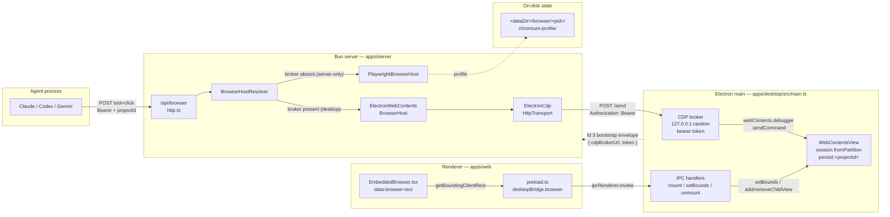
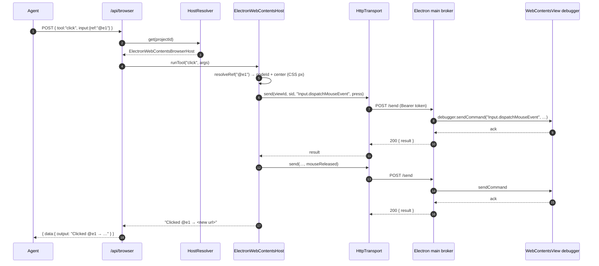
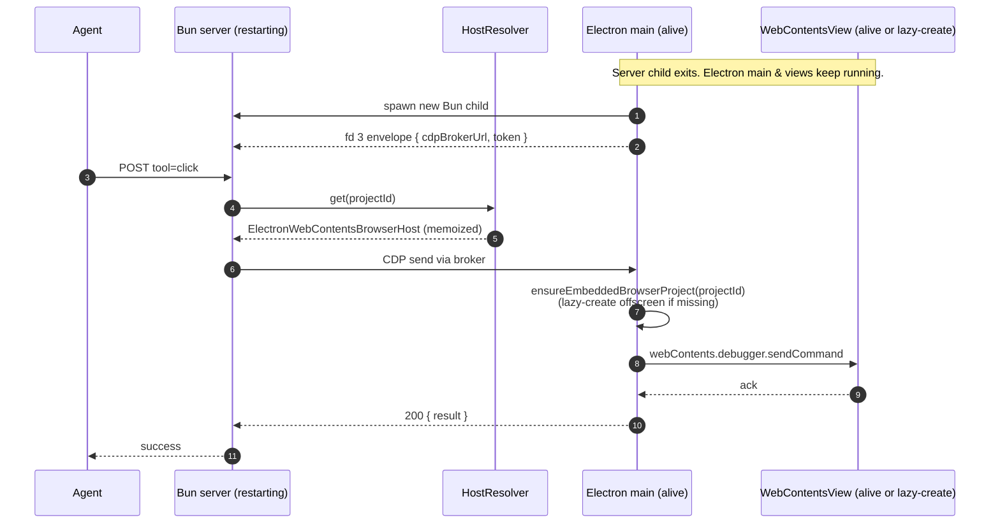
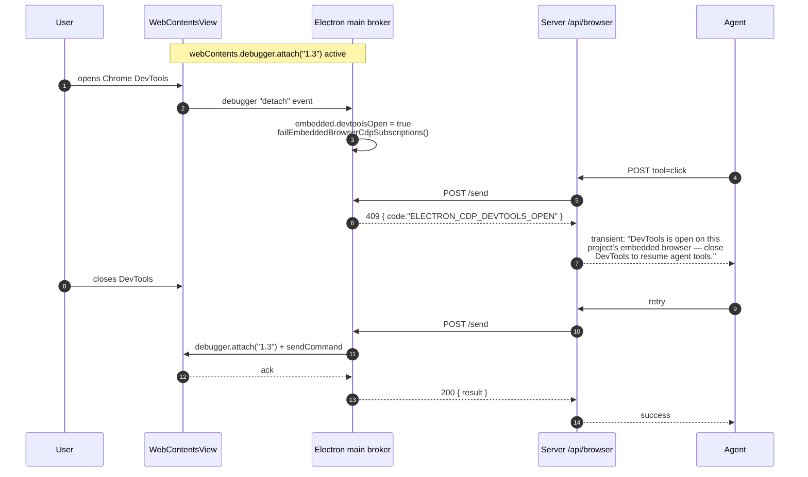

# Browser Automation

In-process Chromium automation exposed to AI sessions via the `/api/browser` REST endpoint. Built by vendoring [GStack Browser](https://github.com/gstack/gstack) (MIT, © Garry Tan) into `apps/server/src/browser/core/` byte-identically, with T3-specific wrappers around it.

See the `NOTICE` file at `apps/server/src/browser/NOTICE` for the full attribution, vendoring approach, and list of intentionally-not-vendored files.

---

## Overview

T3 Code runs Chromium in-process per project. In the desktop runtime each project owns a single, always-on Electron `WebContentsView` (created lazily on first agent CDP request or first user mount, kept alive for the life of the Electron main process). In theoretical server-only deployments — `apps/server` started without `apps/desktop` — projects fall back to a Playwright-managed `launchPersistentContext`. Both hosts share the same per-project Chromium profile dir so cookies, localStorage, and auth sessions survive across restarts. Agents drive whichever host is active through plaintext-returning HTTP commands that use stable `@ref` element identifiers from an accessibility snapshot instead of fragile CSS selectors.

Desktop visibility is decoupled from lifecycle (per [T3CO-421](t3://ticket/T3CO-421)). The renderer owns a URL bar and a `data-browser-rect` sentinel; Electron main mounts the project's already-warm `WebContentsView` over that rect when the user opens the embedded UI, and on close `removeChildView`s it from the visible window and re-parks it in a hidden `BaseWindow` so Chromium keeps compositing it. The `WebContents` and its CDP debugger session stay alive throughout — agents continue to drive the page (including paint-dependent commands like screenshots and PDF) at full speed regardless of whether the embedded UI happens to be open.

Agent calls reach the embedded view through an Electron-main-owned loopback CDP broker. Desktop startup creates a localhost broker with a random bearer token and sends `{ electronCdpBrokerUrl, electronCdpBrokerToken }` to the Bun server in the one-shot bootstrap envelope. The server wraps that endpoint in `CdpBroker`, so `/api/browser` commands for any project drive the corresponding `WebContentsView`. If the project's view doesn't exist yet (cold-start, never mounted), the broker handler creates it offscreen before dispatching. If Chrome DevTools steals `webContents.debugger`, broker calls return the transient DevTools-open error until the debugger reattaches.

| Field             | Value                                                                       |
| ----------------- | --------------------------------------------------------------------------- |
| Endpoint          | `/api/browser`                                                              |
| Auth              | Bearer token (per-thread, `managedRunService.issueMcpAccess`) or dev-bypass |
| Response envelope | `{ data: { message, data: { output: string } }, error: null }`              |
| Total tools       | 58 (navigate, read, interact, snapshot/screenshot, meta, batch)             |
| Desktop host      | Electron `WebContentsView` + `webContents.debugger` CDP (always on)         |
| Server-only host  | Playwright Chromium, `launchPersistentContext`                              |
| Profile dir       | `<dataDir>/browser/<projectId>/chromium-profile/`                           |

## Host selection

`/api/browser` resolves one host per project, decided once at server start by whether the resolver was wired with an Electron CDP broker:

- **Electron `WebContentsView` host** — used for every project in the desktop runtime. The `WebContentsView` is created lazily on first need (first agent CDP call OR first user mount) and stays alive for the life of the Electron main process. Visibility is independent of lifecycle: closing the embedded UI removes the view from the window but keeps the `WebContents` and debugger alive.
- **Playwright host** — used only when the server is started without the desktop process (e.g., headless CI). Owns a persistent Playwright Chromium context under the same `<dataDir>/browser/<projectId>/chromium-profile/` profile directory.

There is no per-project host configuration, no `host.json`, and no recovery window. The decision is made once when the resolver is constructed.

---

## Call pattern

```bash
# Discover tools
curl -s "${BASE_URL}/api/browser?projectId=${PID}&threadId=${TID}" \
  -H "Authorization: Bearer ${TOKEN}"

# Invoke a tool
curl -s -X POST "${BASE_URL}/api/browser?projectId=${PID}&threadId=${TID}" \
  -H "Authorization: Bearer ${TOKEN}" \
  -H "Content-Type: application/json" \
  -d '{"tool":"goto","input":{"url":"https://example.com"}}'
```

Every successful response wraps the command's plaintext output:

```json
{
  "data": { "message": "OK", "data": { "output": "Navigated to https://example.com (200)" } },
  "error": null
}
```

Errors use the standard T3 shape:

```json
{ "data": null, "error": "Unknown tool: totallyFake" }
```

---

## The `@ref` system

The defining feature vs traditional CSS-selector-based automation. `snapshot` returns the accessibility tree with a stable `@e<N>` (interactive element) or `@c<N>` (cursor-interactive — `cursor:pointer`, `onclick`, `tabindex`) identifier per element. Use those refs in follow-up `click`, `fill`, `hover`, `attrs`, `css`, `is`, `screenshot`, `upload` calls.

Refs are invalidated on navigation — re-call `snapshot` after any `goto`, `click`, or `reload` that changes the page.

```json
// 1. snapshot
{"tool":"snapshot","input":{"interactive":true}}
// → "@e1 [link] \"Learn more\""

// 2. click by ref
{"tool":"click","input":{"ref":"@e1"}}
// → "Clicked @e1 → now at https://www.iana.org/help/example-domains"

// 3. re-snapshot (refs invalidated by navigation)
{"tool":"snapshot","input":{"interactive":true}}
```

CSS selectors still work as a fallback for any command that takes a `ref` or `selector` field, but refs are preferred — they survive minor DOM changes and are deterministic across snapshots.

---

## Command inventory

### Navigate

| Tool                        | Purpose                                    |
| --------------------------- | ------------------------------------------ |
| `goto`                      | Navigate to URL, wait for DOMContentLoaded |
| `back`, `forward`, `reload` | History / reload                           |
| `url`                       | Current URL of active tab                  |

### Read

| Tool                           | Purpose                                                                           |
| ------------------------------ | --------------------------------------------------------------------------------- |
| `text`                         | Cleaned visible text (scripts/styles/svg stripped)                                |
| `html`                         | innerHTML of a selector, or full page HTML                                        |
| `links`                        | All links as `text → href`                                                        |
| `forms`                        | Form fields as JSON (passwords + token-shape values redacted)                     |
| `accessibility`                | Raw ARIA tree (no @refs — use `snapshot` for refs)                                |
| `js` / `evaluate`              | Run JS expression, return result as string                                        |
| `eval`                         | Run JS read from a file (path must be safe)                                       |
| `css`                          | Computed CSS value of property on selector                                        |
| `attrs`                        | All attributes of element as JSON                                                 |
| `is`                           | State check: visible / hidden / enabled / disabled / checked / editable / focused |
| `console`, `network`, `dialog` | Captured console / network / dialog buffers                                       |
| `cookies`, `storage`           | Cookies JSON, localStorage+sessionStorage JSON                                    |
| `perf`                         | Page load timing metrics                                                          |
| `inspect`                      | CDP-driven box model + computed styles + matched rules                            |
| `media`                        | Discover ``, `<video>`, `<audio>`, CSS background-image                      |
| `data`                         | JSON-LD, Open Graph, Twitter Cards, meta tags                                     |

### Interact

| Tool                                                        | Purpose                                                                                            |
| ----------------------------------------------------------- | -------------------------------------------------------------------------------------------------- |
| `click`, `fill`, `hover`, `type`, `press`, `scroll`, `wait` | Standard interactions                                                                              |
| `select`                                                    | Dropdown option by value / label / text                                                            |
| `viewport`                                                  | Set viewport size (e.g. `1024x768`)                                                                |
| `cookie`, `cookie-import`, `cookie-import-browser`          | Cookie management (last reads from installed browsers — Chrome, Edge, Brave, Arc, Chromium, Comet) |
| `header`                                                    | Custom request header on future requests (colon-separated)                                         |
| `useragent`                                                 | Override UA (works on Electron host; broken on Playwright host — see known issues)                 |
| `upload`                                                    | Upload file(s) via `<input type=file>`                                                             |
| `dialog-accept`, `dialog-dismiss`                           | Auto-handle next alert/confirm/prompt                                                              |
| `style`                                                     | Live CSS modification via CDP with undo history                                                    |
| `cleanup`                                                   | Remove ads / cookie banners / overlays / clutter                                                   |
| `prettyscreenshot`                                          | `cleanup --all` + screenshot                                                                       |

### Visual / Meta

| Tool                                | Purpose                                                                                                                                   |
| ----------------------------------- | ----------------------------------------------------------------------------------------------------------------------------------------- |
| `snapshot`                          | Accessibility tree with @refs; supports `interactive`, `compact`, `depth`, `selector`, `diff`, `annotate`, `cursorInteractive`, `heatmap` |
| `screenshot`                        | PNG — full page, viewport, clipped, or element; disk path or base64 data URI                                                              |
| `pdf`                               | Export current page as PDF (Electron host uses `webContents.printToPDF`; Playwright host uses `Page.printToPDF`)                          |
| `responsive`                        | Screenshots at multiple viewport sizes                                                                                                    |
| `diff`                              | Unified text diff vs previous snapshot                                                                                                    |
| `tabs`, `tab`, `newtab`, `closetab` | Tab management                                                                                                                            |
| `focus`                             | Bring browser window to front (headed mode only)                                                                                          |
| `status`                            | Connection mode, tab count, active URL                                                                                                    |
| `ux-audit`                          | Heuristic UX/accessibility audit                                                                                                          |

### Batch

`batch` runs up to 50 of the above sequentially in one request. Each entry is `{ tool, input }` — same shape as a top-level POST. Nested `batch` is rejected. Per-entry errors surface as `[N] toolName ERROR: ...` lines in combined output; the overall request still resolves successfully so agents can inspect partial progress.

### Native Day-1 vs Deferred

The Electron host implements the day-1 native surface for navigation, core read commands, core interactions, snapshot/ref commands, screenshots/PDF, tabs, cookies/storage, headers, console/network/dialog buffers, style/cleanup, and status/UX audit.

Three tools are intentionally deferred in native mode and return the standard parity message:

| Tool                    | Reason deferred                                                                                  |
| ----------------------- | ------------------------------------------------------------------------------------------------ |
| `eval`                  | Depends on reading and executing a local file through the Playwright-oriented handler path.      |
| `cookie-import-browser` | Imports cookies from external installed browsers into a Playwright context; needs native review. |
| `responsive`            | Produces multiple viewport screenshots and needs native bounds/DPR-specific behavior.            |

Two tools are permanently unsupported in the embedded host:

| Tool         | Native behavior                                                                                   |
| ------------ | ------------------------------------------------------------------------------------------------- |
| `focus`      | Not meaningful because the native browser already lives inside the Electron app window.           |
| `visibility` | Playwright-only layer command; embedded visibility is controlled by the renderer bounds protocol. |

---

## Architecture

### Cross-process wiring

Four processes cooperate. The renderer owns the browser's on-screen rect; Electron main owns the `WebContentsView` and the CDP broker; the Bun server translates `/api/browser` tool calls into CDP commands; the agent process drives tools over HTTP.



The broker URL and bearer token are generated at Electron startup (`apps/desktop/src/main.ts` — `startBrowserCdpBrokerServer`) and delivered to the Bun child on fd 3 as part of the one-shot bootstrap envelope. The server builds `ElectronCdpHttpTransport` from that URL/token and never talks to Electron any other way. See [browser-transport-decision.md](./browser-transport-decision.md) for why this is an HTTP loopback and not fd framing or `utilityProcess`.

### Server-side dispatch

```
apps/server/src/browser/http.ts            — REST handler, auth, { tool, input } parse
apps/server/src/browser/handlers.ts        — table-driven SPECS, argsFromInput → string[]
apps/server/src/browser/BrowserHostResolver.ts
   │  electronBroker absent  → PlaywrightBrowserHost  (server-only)
   │  electronBroker present → ElectronWebContentsBrowserHost (desktop)
   ▼
BrowserHost.runTool(...)
   ├─ PlaywrightBrowserHost          → BrowserManager → vendored gstack core → Playwright Chromium
   └─ ElectronWebContentsBrowserHost → CdpBroker → Electron main → WebContentsView
```

### Host resolution

`BrowserHostResolver.get(projectId)` is a one-line decision driven entirely by whether the resolver was constructed with an Electron CDP broker. There is no on-disk state, no `host.json`, no recovery window, no per-project configuration. Per [T3CO-421](t3://ticket/T3CO-421) every project in the desktop runtime resolves to the always-on Electron `WebContentsView` host; only theoretical server-only deployments (`apps/server` started without `apps/desktop`) ever fall back to Playwright.


Implementation: `apps/server/src/browser/BrowserHostResolver.ts`. The Electron host is memoized per project so `@ref` maps, snapshot/console/network/dialog buffers, and CDP subscriptions survive between HTTP requests (T3CO-350).

### Bounds protocol (renderer ↔ main)

The renderer is the source of truth for the browser's on-screen rect. `EmbeddedBrowser.tsx` renders a `data-browser-rect` DOM sentinel and calls `getBoundingClientRect()` on mount, resize, and layout change. The preload bridge (`apps/desktop/src/preload.ts`) exposes project-scoped IPC channels:

| Channel                      | Renderer call                                  | Main handler                                                                                                                         |
| ---------------------------- | ---------------------------------------------- | ------------------------------------------------------------------------------------------------------------------------------------ |
| `BROWSER_MOUNT_CHANNEL`      | `browserBridge.mount(pid, bounds)`             | retrieve the project's always-on `WebContentsView` (lazy-create offscreen if needed), `setBounds`, `window.contentView.addChildView` |
| `BROWSER_SET_BOUNDS_CHANNEL` | `browserBridge.setBounds(pid, bounds)`         | `.setBounds(bounds)` on the project-scoped active view                                                                               |
| `BROWSER_UNMOUNT_CHANNEL`    | `browserBridge.unmount(pid)`                   | project-scoped `removeChildView` + re-park view in the offscreen `BaseWindow` host + pause media (view stays alive and composited)   |
| `BROWSER_GET_URL_CHANNEL`    | `browserBridge.getUrl(pid)`                    | read the project-scoped active tab URL                                                                                               |
| `BROWSER_LIST_TABS_CHANNEL`  | `browserBridge.listTabs(pid)`                  | summarize project-scoped tabs                                                                                                        |
| `BROWSER_NAVIGATE_CHANNEL`   | `browserBridge.navigate(pid, url)`             | navigate the project-scoped active tab                                                                                               |
| `BROWSER_NEW_TAB_CHANNEL`    | `browserBridge.newTab(pid, url?, bounds?)`     | open a project-scoped tab; optional target bounds prevent device-emulation flash                                                     |
| `BROWSER_SWITCH_TAB_CHANNEL` | `browserBridge.switchTab(pid, tabId, bounds?)` | switch project-scoped tabs; optional target bounds are applied before mounting the incoming tab                                      |
| `BROWSER_CLOSE_TAB_CHANNEL`  | `browserBridge.closeTab(pid, tabId, bounds?)`  | close a project-scoped tab; optional next-tab bounds are applied before mounting the fallback active tab                             |

The view is cached per project for the life of the Electron main process — unmount removes it from the visible window and re-parks it in the offscreen `BaseWindow` host (see the "Always-on per project" and "Offscreen `BaseWindow` parking" key design decisions below) so cookies, scroll position, JS state, AND the Chromium compositor all survive toggling. Every post-mount renderer IPC call includes the expected project id; Electron main ignores stale calls when that id no longer matches the window's active embedded-browser project. This prevents delayed bounds, unmount, URL, tab, or navigation requests from a previous project from attaching or reading the newly active project's browser surface. See `apps/desktop/src/main.ts` around the `BROWSER_*_CHANNEL` handlers, `createEmbeddedBrowserTab`, and `parkEmbeddedBrowserView` for the lifecycle.

Tab new/switch/close IPC may include the target tab's intended bounds. The renderer computes those bounds from the current pane geometry plus the target tab's known device-emulation state before asking Electron main to reparent the `WebContentsView`; for emulated tabs it predicts the final emulated pane padding instead of reading the current tab's DOM classes. The renderer also commits the local active-tab state before sending switch/close IPC. Foreground new-tab opens render an optimistic temporary blank tab in the same frame as the pane layout change, then replace it when Electron returns the real tab id. Main suppresses the intermediate "tab created, old tab still active" broadcast for foreground opens, updates `project.bounds` before mounting the incoming tab, and only then broadcasts the final active-tab state. Blank tabs are not loaded as raw Chromium `about:blank`; Electron main loads a pre-styled inert `data:text/html` document, waits for that document before mounting the new blank tab, and maps it back to public `about:blank` for `getUrl`/tab summaries. Embedded browser views also set a theme-matched native background color and blank tabs are summarized without Chromium's title/favicon, so fresh tabs stay visually named `New Tab`. The renderer's temporary blank-tab surface uses the same explicit blank background as the native blank document rather than `bg-background`, avoiding a React-placeholder → native-view color handoff.

### Hidden-view media pause

When a view is hidden (project swap, toggle off, or unmount), Electron main sends a `Runtime.evaluate` that pauses every `<video>` and `<audio>` element on the page. This is **immediate** and unconditional — the moment the user closes the browser pane, audible media stops. The CPU is **not** throttled at this point; agent `/api/browser` calls run at full speed. The implementation is `pauseEmbeddedBrowserMedia` in `apps/desktop/src/main.ts`.

Distinct from idle suspension (next subsection): media pause fires on UI hide; idle suspension fires after a long inactivity timeout. Both can apply to the same hidden view.

### Idle suspension

After a configurable period of inactivity (default 30 min), an unmounted project's `WebContentsView` is suspended: Electron main calls `webContents.setBackgroundThrottling(true)` and `setAudioMuted(true)` on every tab in the project. The `WebContents`, debugger session, and offscreen-host parking remain intact — only Chromium-internal compositing/timer rates and audio output are affected. Resume is automatic on the next agent CDP call, user mount, or page event.

Activity signals tracked: incoming CDP broker requests, `BROWSER_MOUNT_CHANNEL` / `BROWSER_UNMOUNT_CHANNEL` IPC, `did-finish-load`, and `before-input-event`. Visible (`mounted: true`) projects are never candidates for suspension.

Configured via Settings → Browser → "Suspend idle browsers after [N] min". `0` disables suspension. Setting changes are picked up by the next sweep (≤ 60s).

Implementation: `runEmbeddedBrowserIdleReaperSweep`, `markEmbeddedBrowserActive`, `suspendEmbeddedBrowserProject`, and `resumeEmbeddedBrowserProject` in `apps/desktop/src/main.ts`. The pure decision rule is `shouldSuspendForIdle` in `apps/desktop/src/embeddedBrowserIdleReaper.ts`. See [T3CO-422](t3://ticket/T3CO-422).

### Viewport emulation

The embedded browser pane includes a Devices toolbar (toggle in the URL bar, `MonitorSmartphoneIcon`) that simulates any viewport via Chromium's `Emulation.setDeviceMetricsOverride` + `setTouchEmulationEnabled` + `setUserAgentOverride` — the same mechanism that powers Chrome DevTools' device toolbar. Curated presets cover common iOS/Android/desktop sizes (iPhone SE through Desktop 1920×1080); Custom mode exposes width, height, DPR, and a mobile flag; Rotate swaps width and height; Reset clears emulation.

State is **per-tab and ephemeral** (matches DevTools' session-only model). Switching tabs swaps which emulation is applied; closing the project clears the map. Chromium retains the override across same-tab navigation until cleared.

When the simulated viewport is **smaller** than the physical pane, the pane letterboxes the inner rect with a dark `bg-black/80` background. When **larger**, the outer container scrolls (`overflow-auto`). The `WebContentsView` follows the inner rect's CSS dimensions via the existing `BROWSER_SET_BOUNDS_CHANNEL` flow — `dontSetVisibleSize: true` on the CDP override tells Chromium "the host is handling visible size, just emulate the metrics."

CDP wiring: renderer → `desktopBridge.browser.setViewport(projectId, tabId, params | null)` → `BROWSER_SET_VIEWPORT_CHANNEL` IPC → `sendBrowserCdp` in `apps/desktop/src/main.ts`. Touching emulation also calls `markEmbeddedBrowserActive`, so an idle-suspended view resumes automatically. Implementation: `EmbeddedBrowserViewportToolbar` and `devicePresets.ts` in `apps/web/src/components/browser/`. See [T3CO-423](t3://ticket/T3CO-423).

### Popout window

The Pop Out button (↗ icon, in the URL bar) detaches the project's `WebContentsView` into a free-floating Electron `BrowserWindow`. The same `WebContents` instance and CDP debugger session move with it; agents driving `/api/browser` don't notice the move because reparenting between windows preserves the underlying view. Closing the popout (or clicking "Bring back" in the embedded pane's placeholder) reattaches to the inline pane.

One popout per project — clicking Pop Out again while a popout exists focuses the existing window. Multiple projects can each have their own popout independently. The popout window destroys its child views unless they are parked first, so the `close` handler runs `parkEmbeddedBrowserView` before the window finalizes; the main window's `EmbeddedBrowser` mount effect then re-attaches the view when the user returns to it.

The popout renderer is a thin shell that skips the full app router — `apps/web/src/main.tsx` checks for `?popout=<projectId>` at app boot and renders `EmbeddedBrowserPopoutApp` (just the `EmbeddedBrowser` component on a fullscreen background). Main-process state push: `BROWSER_POPOUT_STATE_CHANNEL` is broadcast to every window so the main app shows the placeholder while the popout is open. Implementation: `openPopoutWindow` / `closePopoutWindow` / `popoutWindowsByProjectId` in `apps/desktop/src/main.ts`; `EmbeddedBrowserPopoutApp` in `apps/web/src/components/browser/`. See [T3CO-424](t3://ticket/T3CO-424).

### Key design decisions

- **Vendored code is byte-identical to upstream.** The `core/**` directory is excluded from T3's typecheck (DOM globals + `exactOptionalPropertyTypes` + strict null make gstack fail T3's compiler settings). `handlers.ts` bridges with dynamic `import("./core/...ts")` calls at runtime and declares minimal local interfaces for the vendored types it touches.
- **Composition, not modification.** Per-project Chromium profiles, T3-scoped data directories, and the REST surface live in T3-authored files outside `core/`. Never edit vendored files — pull-up cost would be paid on every gstack refresh.
- **Plaintext output.** Every command returns plaintext, not structured JSON. Agents read output directly; the envelope is only for transport. This saves ~2k tokens per command vs typical JSON-framed MCP tool output.
- **Bun production runtime.** The vendored `cookie-import-browser.ts` imports `bun:sqlite` at module load time. Rather than shim that, T3 runs `apps/server` under Bun in production (T3 already depends on `@effect/sql-sqlite-bun`). Tracked at [T3CO-328](t3://ticket/T3CO-328) for the `package.json` `start` script flip.
- **CDP broker instead of remote debugging port.** Electron main exposes only a bearer-protected loopback broker to the child server. There is no public `--remote-debugging-port`; the bootstrap envelope passes the random broker URL/token.
- **Always-on per project ([T3CO-421](t3://ticket/T3CO-421)).** Each project's `WebContentsView` is created lazily on first need — either the user opens the embedded UI or an agent issues a CDP request — and stays alive for the life of the Electron main process. Visibility (mounted in a window) is independent of lifecycle (process exists). Closing the embedded UI removes the view from the window but keeps the `WebContents` and its debugger session intact, so agents continue to drive the browser without interruption. There is no `host.json`, no recovery window, no sticky host assignment.
- **Offscreen `BaseWindow` parking.** Chromium suspends the compositor for any `WebContentsView` that is not attached to some window's `contentView`, which makes paint-dependent CDP commands (`Page.captureScreenshot`, `Page.printToPDF`, media extraction, annotated snapshots) return blank or hang. To keep the always-on contract honest for hidden projects, every embedded view that is not currently mounted in a real `BrowserWindow` is parented to a single hidden `BaseWindow` (`show: false`, offscreen position, `skipTaskbar`). On UI mount the view moves into the real window via `addChildView`; on unmount, tab switch, project switch, and modal suspend it is re-parked in the offscreen host. Implementation: `ensureOffscreenBrowserHost` and `parkEmbeddedBrowserView` in `apps/desktop/src/main.ts`.
- **Idle suspension ([T3CO-422](t3://ticket/T3CO-422)).** Always-on does not mean always-paying. After a configurable idle period (default 30 min, configurable via Settings → Browser, `0` disables), an unmounted project is suspended via `webContents.setBackgroundThrottling(true)` and `setAudioMuted(true)`. The `WebContents`, debugger session, and offscreen parenting are preserved; only compositing rates and audio output drop. Activity signals (CDP broker, mount/unmount IPC, `did-finish-load`, `before-input-event`) immediately resume the view with no agent-visible error. Visible projects are never candidates. The reaper runs once per minute and reads the threshold from `settings.json` on each sweep, so changes take effect without a restart.
- **Viewport emulation via CSS-driven bounds ([T3CO-423](t3://ticket/T3CO-423)).** The Devices toolbar resizes the inner pane rect via inline CSS rather than commanding Chromium to letterbox. The `WebContentsView` follows the rect's bounds via the existing `BROWSER_SET_BOUNDS_CHANNEL` `ResizeObserver` flow, so the same bounds plumbing handles both natural-size and emulated-size cases. CDP `Emulation.setDeviceMetricsOverride` is dispatched with `dontSetVisibleSize: true`, telling Chromium to render at the simulated CSS pixels without trying to resize the host view. State lives only in the React component (per-tab map); no persistence, matching DevTools' session-only behavior.
- **Popout via reparenting, not recreation ([T3CO-424](t3://ticket/T3CO-424)).** The Pop Out action moves the project's existing `WebContentsView` between the main window and a new free-floating `BrowserWindow` via `addChildView` / `removeChildView`. The same `WebContents`, debugger session, and Chromium profile partition follow the view across the boundary, so agent CDP calls keep working without a debugger reattach. A `close` handler parks the view in the offscreen `BaseWindow` before the popout's contentView destruction reaches it. Popout state is pushed (`BROWSER_POPOUT_STATE_CHANNEL`) to every window so the main pane swaps to a placeholder without polling. The popout renderer skips the app router entirely (`?popout=<projectId>` query at app boot) so window boot stays cheap.

### Per-project profiles

Profile directory layout (production — `~/.t3/userdata/browser/<projectId>/chromium-profile/`):

```
Cookies                      Cache                       GPUCache
Cookies-journal              Code Cache                  Local Storage
PersistentOriginTrials       DIPS                        ...
```

The BrowserManager layer lazy-launches a persistent context on the first `acquire(projectId)` call and holds it in a `Map<ProjectId, BrowserContext>`. Contexts are closed (not deleted on disk) after 30 minutes of idle time, and a fresh launch restores all persistent auth state from the profile dir. A project's Chromium crash evicts only that project's context — other projects keep running.

Dev server: paths resolve under `~/.t3/dev/browser/<projectId>/...` when `ServerConfig.devUrl` is set (Electron dev mode), otherwise `~/.t3/userdata/browser/<projectId>/...`.

Native embedded profiles live inside Electron's own `persist:<projectId>` partition storage, separate from but co-located with the Playwright profile dir under `<dataDir>/browser/<projectId>/`. Because the partition name embeds the canonical project id, any future project import/merge flow that rewrites ids must migrate the Electron partition as well.

### Retina / DPR

All browser tool coordinates are CSS pixels. The Electron host normalizes CDP details internally: `DOM.getBoxModel` and `Input.dispatchMouseEvent` use CSS pixels, while `Page.captureScreenshot` returns device pixels. Screenshot output remains the familiar browser-tool payload, and any future coordinate-to-screenshot correlation must keep the `devicePixelRatio` multiplier in mind on Retina displays.

### DevTools Conflict Policy

Electron allows only one `webContents.debugger` client per `WebContents`. When the user opens Chrome DevTools on the embedded browser, Electron detaches T3's debugger. While detached, native `/api/browser` calls fail with a clear transient error asking the user to close DevTools; Electron then reattaches and agent tools resume. Native Chrome DevTools coexistence is not planned for this host. A future T3-owned DevTools panel should use the same `CdpBroker` rather than competing for the debugger client.

### Extension Support

Extensions are host-scoped. `session.loadExtension(path)` attaches to an Electron `Session`, so loaded extensions apply only when the project is Electron-authoritative. Playwright projects do not see Electron-loaded extensions, and full extension management UI must gate on host kind.

The Phase 4 smoke audit used `scripts/embedded-browser-extension-audit.cjs` against Electron 40.6.0:

- MV2 content-script extension loaded with the expected deprecation warning; its JS injected and its CSS hiding rule applied.
- MV3 extension loaded; content script messaged the service worker successfully; `chrome.runtime`, `chrome.storage.local`, `chrome.tabs.query`, `chrome.scripting.executeScript`, and `chrome.action` were present in the tested contexts.
- The MV3 action popup was directly loaded in a hidden Electron `BrowserWindow` at its `chrome-extension://<id>/popup.html` URL. It rendered successfully, messaged the service worker, and `chrome.tabs.query({ active: true, currentWindow: true })` returned the active audit page tab.
- No interactive permission prompts surfaced during install, content-script injection, service-worker messaging, or popup rendering; permissions came from the manifest. The current embedded UI still has no native toolbar/action affordance, so user-invoked popup UI remains future extension-management work.

### Chromium bundle

Playwright's Chromium binary is shipped inside the packaged desktop app rather than downloaded on first launch. The build script (`scripts/build-desktop-artifact.ts`) runs `bunx playwright install chromium` with `PLAYWRIGHT_BROWSERS_PATH` pointing at a staged directory, which electron-builder then copies into `Resources/playwright-browsers/` via `extraResources`. At runtime, `backendChildEnv()` in `apps/desktop/src/main.ts` sets `PLAYWRIGHT_BROWSERS_PATH` to that directory before spawning the backend, so Playwright finds the bundled copy.

Runtime install is not supported: `playwright/cli.js` is unresolvable from inside `app.asar.unpacked` under the Bun runtime, and a lazy 200 MB download on first use is user-hostile anyway. If the bundled copy is missing, `assertChromiumAvailable` in `BrowserManager.ts` logs a clear diagnostic at startup and the first `goto` fails loudly.

Dev builds leave `PLAYWRIGHT_BROWSERS_PATH` unset, so Playwright uses the developer's `~/Library/Caches/ms-playwright/` install (`bunx playwright install chromium` once per machine).

---

## Sequence diagrams

### Agent click on a desktop project

Two CDP commands per click — `mousePressed` then `mouseReleased` — each a separate broker round-trip. Ref resolution happens once on the server side before any CDP traffic, so a stale `@ref` fails fast without hitting Electron.



### Server restart recovery

Electron main and every `WebContentsView` survive a Bun server restart. The new server child reads the broker URL and token from the fd 3 bootstrap envelope, and `/api/browser` works immediately — there is no per-project recovery state machinery to wait on. Per [T3CO-421](t3://ticket/T3CO-421) the resolver returns the always-on Electron host on every call when a broker is wired, so the first agent request after restart succeeds without retries. If the request targets a project whose `WebContentsView` has not yet been created (cold start, never mounted), the CDP broker handler in Electron main creates it offscreen on demand before dispatching. See [startup-recovery.md](./startup-recovery.md) for the broader restart story.



### DevTools conflict and reattach

Electron allows only one `webContents.debugger` client per `WebContents`. When the user opens Chrome DevTools on the embedded browser, the OS-level DevTools takes the slot and Electron fires `detach` on T3's debugger. `/api/browser` calls for that project return a 409 with code `ELECTRON_CDP_DEVTOOLS_OPEN` and a human-readable message until DevTools closes; the next `sendCommand` call transparently reattaches.



---

## Known issues

- **`useragent`** (Playwright host only) — calls the vendored `recreateContext()`, which assumes `this.browser !== null`. Under `launchPersistentContext` there is no separate Browser object, so the call crashes and resets the active tab to `about:blank`. Tracked at [T3CO-331](t3://ticket/T3CO-331). Avoid on the Playwright host; works end-to-end in the Electron embedded host (`Network.setUserAgentOverride` via CDP).

## JavaScript dialog handling (Electron host)

`alert()`, `confirm()`, and `prompt()` on the embedded `WebContentsView` would, by default, render a Chromium-native window-modal dialog attached to the owning BrowserWindow — blurring the entire T3 Code UI (chat input, sidebars, everything), not just the webview region. The CDP `Page.javascriptDialogOpening` event does not fire reliably through our broker before the native modal appears, so an out-of-band CDP handler can't intercept in time.

The Electron host addresses this with two layers:

1. **`webPreferences.disableDialogs: true`** on the `WebContentsView` — Chromium's native dialog path is suppressed entirely. No window-modal, no UI block.
2. **Page-side override** installed via `Page.addScriptToEvaluateOnNewDocument` on every new document. The shim replaces `window.alert/confirm/prompt` with functions that:
   - Push a record into `window.__t3_captured_dialogs[]` (with type, message, timestamp, and the `handled` outcome actually applied).
   - Read `window.__t3_dialog_policy` to decide the synchronous return value.
   - Reset `window.__t3_dialog_policy` to the accept default after each call (one-shot).

`dialog-accept [text]` and `dialog-dismiss` write the new policy to the page via `Runtime.evaluate` immediately before returning, so the next dialog-triggering interaction sees the intended value. `dialog` drains the page-side buffer (also via `Runtime.evaluate`) on demand and merges into the server's dialog history; drains must happen before navigation, or not-yet-drained entries on the old document are lost.

This uses `Runtime.evaluate` (command channel) and sidesteps `Runtime.addBinding` + `Runtime.bindingCalled` because Runtime event subscriptions are not currently delivered through our Electron debugger broker — see [T3CO-7](t3://ticket/T3CO-7). Tracked as [T3CO-2](t3://ticket/T3CO-2).

---

## Related tickets

- [T3CO-318](t3://ticket/T3CO-318) — parent epic
- [T3CO-319](t3://ticket/T3CO-319) — vendor GStack browser code
- [T3CO-320](t3://ticket/T3CO-320) — Playwright lifecycle layer
- [T3CO-321](t3://ticket/T3CO-321) — REST endpoint scaffolding
- [T3CO-322](t3://ticket/T3CO-322) — walking-skeleton commands
- [T3CO-323](t3://ticket/T3CO-323) — full command port
- [T3CO-324](t3://ticket/T3CO-324) — browser admin prompt
- [T3CO-325](t3://ticket/T3CO-325) — integration tests
- [T3CO-328](t3://ticket/T3CO-328) — Bun production runtime switch (deferred)
- [T3CO-329](t3://ticket/T3CO-329) — Chromium auto-install (superseded: Chromium is bundled at build time; see "Chromium bundle" below)
- [T3CO-330](t3://ticket/T3CO-330) — headed/headless UX (deferred)
- [T3CO-331](t3://ticket/T3CO-331) — fix `useragent` under persistent context (deferred)
- [T3CO-333](t3://ticket/T3CO-333) — port pure-logic vendored tests (deferred)

---

## Debugging

| Symptom                                            | Check                                                                                                                                                                                                                                      |
| -------------------------------------------------- | ------------------------------------------------------------------------------------------------------------------------------------------------------------------------------------------------------------------------------------------ |
| `Executable doesn't exist at .../chromium/chrome`  | Dev: run `bunx playwright install chromium` once per machine. Packaged app: the Chromium bundle is shipped in `Resources/playwright-browsers/`; if it's missing the build was incomplete — reinstall the app. See "Chromium bundle" above. |
| `Context recreation failed: null is not an object` | `useragent` crash — see known issues above.                                                                                                                                                                                                |
| Cookies missing after restart                      | Verify profile dir exists at `<dataDir>/browser/<projectId>/chromium-profile/Default/Cookies`. Session cookies (no `max-age`) don't persist; that's per-spec.                                                                              |
| `Ref @e3 not found`                                | Snapshot is stale. Re-call `snapshot` after any navigation.                                                                                                                                                                                |
| Agent doesn't know the endpoint exists             | Settings → Prompts → Browser — confirm the admin prompt is enabled (it's a shipped default). Also check the `## T3 Browser Automation` block is present in the rendered system prompt for the failing session.                             |

---

## Overlay View System

Electron's `WebContentsView` is an OS-level compositor surface that always paints above HTML/React DOM — no CSS `z-index` crosses that boundary. Context menus, dropdowns, and other overlays would disappear behind it without a dedicated solution.

This section documents the Electron/browser plumbing: compositor ordering, overlay pools, IPC, and host bridge mechanics. The UI contract for which popups use native overlays, which stay in DOM, and how both paths preserve visual/interaction parity lives in [Overlay Surfaces](overlays.md). When a change affects overlay selection or interaction semantics, update `docs/overlays.md` first and keep this section focused on implementation mechanics and concrete examples.

When the embedded browser is active, overlays render in their own `WebContentsView` (the "overlay view") positioned above the embedded browser in the window's compositor stack. The browser stays visible at all times. When the embedded browser is not mounted the system is inactive — all overlays render in the host DOM as normal, with no behavioral difference.

`Menu`, `Select`, `Combobox`, `Autocomplete`, and composer-command popups use the primitive overlay path when their callsite can provide serialized rows plus discrete host callbacks. Arbitrary React content uses the routed overlay path below: the overlay view runs the same React component tree in a second Vite entry and returns a typed result/event payload to the host. Remaining DOM/suspension surfaces should be explicit exceptions, not accidental gaps.

### Architecture

```
┌─────────────────────────── BrowserWindow ──────────────────────────────┐
│  contentView                                                             │
│  ├─ hostView (WebContentsView)   ← T3 React app                         │
│  ├─ embeddedBrowserView (WCV)    ← Chromium, per project                │
│  └─ overlayView (WCV)            ← full-window transparent layer        │
│     z-order: overlay > embedded > host                                  │
└─────────────────────────────────────────────────────────────────────────┘
```

### Key files

| File                                                        | Role                                                                                                                                                                                                                                                                                                                                            |
| ----------------------------------------------------------- | ----------------------------------------------------------------------------------------------------------------------------------------------------------------------------------------------------------------------------------------------------------------------------------------------------------------------------------------------- |
| `apps/desktop/src/overlayPool.ts`                           | `OverlayPool` class — manages 2 pre-warmed overlay `WebContentsView`s per window. Parked in an off-screen `BaseWindow` when idle; moved to the main window (topmost) on acquire and returned on release. Also owns all overlay IPC handler registration.                                                                                        |
| `apps/desktop/src/overlay-preload.ts`                       | Dedicated preload for overlay views. Exposes `overlayBridge` (onRender, onClear, emitEvent, requestDismiss, getConfig, onThemeChange). Does NOT expose browser-control APIs.                                                                                                                                                                    |
| `apps/web/overlay.html`                                     | Second Vite entry point. Imports the same `index.css` so Tailwind tokens and component styles are identical to the main app.                                                                                                                                                                                                                    |
| `apps/web/src/overlay.tsx`                                  | Overlay renderer entry — mounts `OverlayShell`, applies theme before first render.                                                                                                                                                                                                                                                              |
| `apps/web/src/components/overlay/OverlayShell.tsx`          | Root overlay component. Full-window transparent div. Positions a zero-size "virtual anchor" div at the trigger's DOMRect so Base UI Positioner can do smart flip/collision-avoidance. Backdrop click calls `requestDismiss()`.                                                                                                                  |
| `apps/web/src/components/overlay/OverlayContent.tsx`        | Switches on `OverlayRenderMessage.type` → delegates to the right component.                                                                                                                                                                                                                                                                     |
| `apps/web/src/components/overlay/Overlay*.tsx`              | Per-overlay-type render components (`OverlayMenu`, `OverlaySelect`, `OverlayCombobox`, `OverlayAutocomplete`, `OverlayComposerCommand`, `OverlayRoute`, `OverlayAlertDialog`, `OverlayImagePreview`). Use the same Base UI primitives and Tailwind classes as the host app.                                                                     |
| `apps/web/src/components/overlay/overlayRouteRegistry.tsx`  | Phase 2 route registry. Routed overlay components register by `routeKey`; `OverlayRoute` resolves the component and provides controller/result helpers.                                                                                                                                                                                         |
| `apps/web/src/components/overlay/OverlayRouteProviders.tsx` | Phase 2 provider shell for routed overlays: `QueryClientProvider` and `AppAtomRegistryProvider`. Overlay entry also installs a WebSocket-backed `window.nativeApi`. Route-dependent providers such as the main app toast viewports stay out of the overlay app until they have a router-free variant.                                           |
| `apps/web/src/overlayRoutes.ts`                             | Imports routed overlay modules for side-effect registration in the overlay app. Add newly migrated routed surfaces here.                                                                                                                                                                                                                        |
| `apps/web/src/nativeOverlayBridge.ts`                       | Host-side bridge. `openNativeOverlay(message, options)` owns the acquire → render → event/result → dismiss → release lifecycle. `openNativeOverlayRoute(input, options)` wraps the Phase 2 routed-overlay protocol. `acquireNativeOverlay(message)` remains as the low-level handle API. `useNativeOverlayActive()` returns the gate condition. |

### Gate condition

```typescript
useNativeOverlayActive() === true
  when: running in Electron
    AND embedded browser is currently mounted
    AND the current app surface leaves that browser visually relevant
```

When `false` (no browser visible, full-page surfaces such as `/settings`, web build, popout window), all overlays render in DOM as normal. Zero behavioral difference for non-browser flows.

### Dual runtime behavior

Overlay-capable primitives intentionally have two rendering modes:

| Browser state                                        | Rendering path                                                                                                                                           |
| ---------------------------------------------------- | -------------------------------------------------------------------------------------------------------------------------------------------------------- |
| Embedded Chromium browser mounted in the main window | Native overlay path. The host adapter serializes menu/select/combobox/autocomplete rows, opens an overlay `WebContentsView`, and keeps Chromium visible. |
| No embedded browser mounted                          | Normal DOM path. The same component renders through its original Base UI portal/content in the host React tree. No overlay IPC is used.                  |
| Full-page app surface covers the browser             | Normal DOM path. Routes such as `/settings` may leave the browser mounted behind the app shell, but the browser is not visually relevant there.          |
| Native overlay unavailable or acquisition fails      | Fallback DOM path. The component should behave exactly like the pre-overlay implementation, including the old suspension behavior where applicable.      |

Adapters must keep both paths first-class. Do not remove the DOM popup/content from callsites just because a native `overlayItems` path exists; the DOM content is still the source of behavior when the browser is hidden, in web builds, in popout-only flows, and in failure fallback. The native path should mirror the DOM UI by reusing the same primitives/classes or shared body components, not by inventing an alternate design.

The native path uses a full-window transparent overlay view, so anchored popups need extra positioning care. The host owns the real trigger DOM node; the overlay view owns only a synthetic fixed-position anchor. While an overlay is open, `trackNativeOverlayAnchor()` samples the host trigger rect with `requestAnimationFrame` and re-renders when the rounded rect changes. `OverlayShell` keys positioned content by that rounded rect so Base UI remounts/recomputes placement during live resize. This keeps popups reasonably close to their targets during active window resizing, with the remaining smoothness bounded by Electron/Chromium repaint and IPC cadence.

### IPC flow

```
Host renderer                    Main process              Overlay view
────────────────                 ─────────────             ────────────
overlay.acquire()   ──invoke──►  pool.acquire()
                    ◄─ id ──────
overlay.render(id, msg) ─────►  send("overlay:render", msg) ──►  OverlayShell.onRender
                                                                  renders popup
ipcRenderer.on(overlay:event)   forward with entry.id  ◄── emitEvent("select", {id})
onEvent fires → resolve(id)
overlay.release(id) ──invoke──►  pool.release()
                                 sends "overlay:clear"  ──►  OverlayShell.onClear
```

Events from the overlay view carry `null` as the overlay ID (the view doesn't know its own ID). The main process replaces it with the correct `entry.id` before forwarding to the host renderer so the `onEvent(id, handler)` filter matches.

`overlay.render(id, msg)` waits for the acquired overlay document's initial `loadURL()` promise before sending `overlay:render`. This is required after app/worktree restarts and for on-demand pool entries; otherwise the host can acquire a view and send the first message before `overlay.html` has installed its IPC listeners, causing a focus flicker with no visible popup.

### Host runtime

Host code should prefer `openNativeOverlay(message, options)` over wiring overlay IPC directly. It returns a session with a `result` promise and a `release()` method for long-lived overlays. The shared runtime owns focus restore, event subscriptions, dismiss resolution, and release cleanup. Event and dismiss subscriptions are attached before the initial render message is sent, so fast routed-overlay bootstrap failures cannot be missed and can reliably fall back to the DOM path. Electron main focuses the overlay `WebContents` after acquire/render so `autoFocus` controls can receive input, then focuses the host `WebContents` on release so app shortcuts work immediately after closing the overlay.

The native-overlay gate is intentionally stricter than "browser WebContents exists." `useNativeOverlayActive()` and `openNativeOverlay()` suppress native acquisition on full-page app surfaces such as `/settings`, because those routes cover the browser even if its `WebContentsView` is still mounted behind the host UI. The old DOM suspension helper uses the same relevance gate, so settings dropdowns render as ordinary DOM popups without native overlay acquisition and without `browser:suspendForModal`. Component-level `overlayItems` can remain wired for those surfaces as preemptive coverage; today they render through the normal DOM path until the layout makes the browser visible beside them.

`browser:unmount` clears the window's active embedded-browser project and advances the mount request generation. Otherwise a stale or late mount can reattach the browser `WebContentsView` after React has hidden the browser pane, leaving an invisible native view over the app that intercepts clicks and makes normal DOM dropdowns appear broken.

Clipboard writes from host callbacks can run while focus is transitioning back from the overlay `WebContents`. `useCopyToClipboard` therefore prefers `desktopBridge.clipboard.writeText()` in Electron and only falls back to `navigator.clipboard.writeText()` in web builds. This avoids Chromium's "Document is not focused" clipboard rejection for native-overlay menu actions such as "Copy plan".

Controlled overlay primitives must forward Base UI close requests back to the native overlay bridge. Menu and composer-command roots call `requestDismiss()` from `onOpenChange(false)`, and select/combobox/autocomplete roots do the same so outside clicks and Escape close the full-window transparent overlay instead of leaving it as an invisible glass pane over the host app.

`Select` keeps a stable controlled `open` state inside the adapter even when it switches between DOM rendering and native overlay rendering. Do not pass `open={false}` only for native mode and `open={undefined}` for DOM mode; Base UI treats that as a controlled/uncontrolled mode switch and can leave dropdown state inconsistent after the embedded browser is shown/hidden.

Primitive native overlays must keep their anchor live while open. The overlay view cannot query the host DOM, so host adapters pass the trigger/input element to `trackNativeOverlayAnchor()`. The helper samples `getBoundingClientRect()` with `requestAnimationFrame` for the lifetime of the open overlay, with resize/scroll/ResizeObserver events waking the same loop, and only re-renders when the rounded rect changes. This keeps overlays following live window resize as closely as Electron/Chromium repaint cadence allows without sending IPC while the anchor is stationary. Do not pass a one-time rect unless the overlay is intentionally fixed to the original coordinates.

`OverlayShell` keys anchored overlay content by the rounded anchor rect. This intentionally remounts Base UI `Positioner` when the virtual anchor moves, because the overlay view only owns a synthetic fixed-position anchor div; updating its inline style alone is not enough for every Base UI primitive to recompute placement during live window resize. Content refreshes with the same anchor keep the same key, so search/menu state updates do not remount just because the serialized rows changed.

For primitive components, the host app should usually go through the component adapter instead of calling the bridge directly. `Menu` supports serialized `overlayItems` plus `overlayOnSelect(id)` / `overlayOnAction(id)`, and falls back to the normal DOM/suspension path if a native overlay cannot be acquired; uncontrolled menus must set their DOM open state during that fallback so the click that failed native acquisition still opens the host popup. `OverlayMenuItem` intentionally models the small set of menu semantics needed to preserve host UI parity today: separators, group labels (`labelOnly`), checked/radio-looking rows (`checked`), icons, shortcuts, disabled state, destructive state, submenus, status dots, badges/descriptions, header actions, and secondary row actions. Header/row action buttons emit non-dismissing `action` events by default so refresh/approve-style controls can keep the menu open while the host updates state and re-renders the same native overlay session; set `dismissOnAction` only for action buttons that intentionally close the menu, like edit/reveal actions that open another surface. The chat provider/model picker, traits picker, compact composer controls menu, Open In picker, MCP servers picker, Skills picker, orchestration thread switcher, and sidebar project/thread sort menu use this path so opening them above a mounted embedded browser no longer hides Chromium. Rich popovers such as the Active Runs card are intentionally not forced through `OverlayMenuItem`; they route through Phase 2 when exact component parity matters.

Use the current primitive overlay path only when the popup can be faithfully represented as serializable menu/select/combobox/autocomplete data and discrete host callbacks. That includes normal command menus, checked menus, grouped menus, select lists, branch/model pickers, serialized typeahead rows, and menu-local buttons whose loading/disabled state can be refreshed by sending a new JSON message to the same overlay session. Keep the DOM/suspension fallback, or move the work to Phase 2, when exact UI parity requires arbitrary React children, forms, TanStack Query state, custom card layouts, routed dialog content, or any component tree that would have to be reimplemented differently inside `OverlayMenuItem`.

The chat header Git actions menu, project-script actions menu, plan action menus, orchestration resume menu, composer implement split-button menu, and Kanban ticket detail actions menu use routed menu overlays instead of serialized `OverlayMenuItem` payloads. Their browser-hidden DOM path and browser-visible native route share the same menu body component; only result transport differs. Because the routed view mounts in a separate overlay React root, Base UI focus/highlight state can differ at open time, so pointer-hover affordances such as row backgrounds and secondary action buttons must be keyed to actual hover state unless keyboard focus is intentionally designed to reveal them.

`Select` has the same acquire-failure fallback for callsites that provide serialized `overlayItems`. `OverlaySelectItem` supports separators, icons, and `hideIndicator` so native selects can mirror host `SelectItem hideIndicator` menus. The embedded-browser viewport toolbar device-preset/zoom selects, branch environment select, proposed scheduled-task project select, scheduled-task editor type/project selects, file-explorer editor settings selects, prompt/ticket scope selects, managed-run filter selects, prompt-editor block-condition select, and main settings selects use this native path.

`Combobox` also has an adapter for serialized result rows. The overlay view owns the search input and emits `search` events; the host can return a refreshed JSON item list through `overlayOnSearch`, then receive the selected value through `overlayOnSelect`. The chat branch selector uses this path so searching/selecting branches above a mounted embedded browser does not suspend Chromium.

`Autocomplete` has the same opt-in constraint for serialized rows. Its native path opens from `AutocompleteInput` / `AutocompleteTrigger`, renders an overlay-owned input copy at the trigger/input rect using the same input classes, and renders the popup/list with the same autocomplete popup/list/item classes. It is not a `CommandDialog` migration: arbitrary command palettes, grouped custom JSX, and routed file-search behavior remain Phase 2 unless a callsite provides a plain JSON row list and discrete search/select callbacks.

The chat composer `@` / `/` / `/model` suggestion menu is handled by a narrow `composer-command` overlay type rather than the generic `Autocomplete` adapter. It sends the already-derived `ComposerCommandItem[]` rows to the overlay and renders the exact `ComposerCommandMenu` component there, while selection/highlight events flow back to `ChatView`. This keeps the file icons, active row styling, loading/empty copy, keyboard navigation, and row spacing identical without treating arbitrary `CommandDialog` content as Phase 1 work.

### Routed Overlays

Phase 2 arbitrary-content overlays use one generic `route` message instead of adding one IPC message per dialog or popover. Use this path for `Dialog`, `AlertDialog`, `Sheet`, `CommandDialog`, arbitrary-child `Popover`, and rich menu/card bodies whose exact UI depends on React children, controlled inputs, TanStack Query, Zustand/store state, WebSocket-backed data, or custom layout.

The host opens a routed overlay with `openNativeOverlayRoute`:

```typescript
const session = await openNativeOverlayRoute<{ submitted: boolean }>(
  {
    routeKey: "project-script.edit",
    params: { scriptId },
    context: { projectId, threadId, cwd },
    presentation: { kind: "dialog" },
  },
  {
    fallback: () => setEditDialogOpen(true),
  },
);

if (!session) return; // fallback was invoked
const result = await session.result;
if (result.status === "submitted") {
  // consume result.value
}
```

`openNativeOverlayRoute` still uses the same `OverlayPool`, `overlay.acquire`, `overlay.render`, result, dismiss, and focus-restore lifecycle as primitive overlays. It resolves to:

- `{ status: "submitted", value }` when the overlay route calls `controller.submit(value)`.
- `{ status: "cancelled", reason? }` when the route calls `controller.cancel(reason)` or the user dismisses the overlay.
- `{ status: "error", message }` when the route fails to bootstrap or throws during render.

Routes can also emit non-dismissing custom events with `controller.bridge.emitEvent(type, payload)`. `useRoutedOverlaySurface` forwards those events through `onEvent` without releasing the overlay, which is the right path for rich popovers whose buttons update host state while staying open. When params change after such a host update, the existing overlay session re-renders with the new payload.

On the overlay side, route components are registered in `overlayRouteRegistry.tsx` and rendered through `OverlayRoute`. Routed components receive:

- `message.params` and `message.context`.
- `controller.submit(value)`, `controller.cancel(reason)`, and `controller.fail(error)`.
- Providers from `OverlayRouteProviders`: TanStack Query and the app atom registry.
- A WebSocket-backed `window.nativeApi` installed by `overlay.tsx`.

#### Routed adapter pattern

Use `apps/web/src/routedOverlayAdapters.tsx` for arbitrary React surfaces. The host callsite keeps its existing DOM component path but gates its `open` prop with `useRoutedOverlaySurface()`:

```typescript
const routed = useRoutedOverlaySurface({
  open,
  onOpenChange: setOpen,
  routeKey: "file-search",
  params: { cwd },
  context: { projectId, threadId, cwd },
  presentation: { kind: "command-dialog" },
});

return (
  <FileSearchModalDom
    open={routed.domOpen}
    onOpenChange={routed.onDomOpenChange}
  />
);
```

When native overlay is active, the hook opens the registered route and keeps the DOM popup closed so Chromium stays visible. When native overlay is inactive, disabled, unavailable, or fails during acquire/bootstrap, `routed.domOpen` follows the original `open` value and the existing DOM/suspension behavior remains intact.

The overlay route component renders the same primitive tree using route wrappers from the same adapter module:

```tsx
registerOverlayRoute("file-search", function FileSearchOverlayRoute({ message }) {
  return (
    <OverlayRouteCommandDialog>
      <CommandDialogPopup>
        <FileSearchModalContent cwd={String(message.params.cwd)} />
      </CommandDialogPopup>
    </OverlayRouteCommandDialog>
  );
});
```

Available route wrappers:

- `OverlayRouteDialog`
- `OverlayRouteAlertDialog`
- `OverlayRouteCommandDialog`
- `OverlayRouteSheet` plus `OverlayRouteSheetPopup`
- `OverlayRoutePopover` plus `OverlayRoutePopoverPopup` / `OverlayRoutePopoverContent`

These wrappers are intentionally thin: they control open/dismiss semantics and then delegate to the existing UI primitives, preserving styles, focus behavior, escape/outside-click handling, nested overlay behavior, and close buttons. Popover routes get the overlay view's virtual anchor via `OverlayRoutePopoverPopup`, so anchored rich popovers can align to the original trigger rect.

`FileSearchModal` keeps the exact command palette component tree, passes recent open tabs as serializable route params because the overlay WebContents cannot see the host WebContents' in-memory file-explorer store, runs fuzzy search inside the overlay through the WebSocket-backed `NativeApi`, and returns the selected relative path to the host so the existing open-file side effect remains host-owned.

`GitActionsControl` routes the commit dialog, default-branch confirmation dialog, and disabled quick-action tooltip through the same shared dialog/popover content used by the DOM fallback. The overlay route owns local form/file-selection state, then returns a small result payload to the host so the existing git action/toast/progress pipeline remains host-owned. Disabled Git menu-item reasons are represented in the native menu payload as item descriptions when the menu itself renders in the overlay view.

`ProjectScriptsControl` routes the add/edit/delete action dialog through the same editor component used by the DOM fallback. The overlay route owns local form state, icon picking, service row editing, validation, and delete confirmation, then submits a serializable save/delete result back to the host so script persistence and keybinding updates remain host-owned.

`ContextWindowMeter` and `RateLimitMeter` route their rich hover popovers through the shared routed-popover helper in `apps/web/src/routedPopover.ts`. The trigger stays in the host DOM, passes a trigger rect plus a serializable snapshot to the overlay route, and both DOM fallback and native overlay render the exact same breakdown/chart content components.

`ManagedRunsControl` routes its Active Runs surface through the routed mini-app path because the menu contains arbitrary React content and actions: run cards, stop buttons, log drawer buttons, runtime service rows, and URL hover controls. The DOM fallback keeps the normal `Menu` path. The browser-visible overlay route uses `OverlayRoutePopover`/`OverlayRoutePopoverPopup` around the same extracted body so nested service URL hover controls remain interactive instead of being interpreted as leaving a command-menu surface.

`ProposeActionCard` routes its action icon picker through the same routed popover helper. The host and overlay render the same icon-grid content, and selection returns the chosen `ProjectScriptIcon` as a route result so the host card state remains authoritative.

`ProposedPlanCard` routes its "Save plan to workspace" dialog through `proposed-plan-save-dialog`. The host and overlay share the same `Dialog` body/input/footer; the overlay performs the same workspace write through `NativeApi` and returns the saved relative path so the host can keep toast/state side effects authoritative.

`PullRequestThreadDialog` routes through `pull-request-thread-dialog`. The shared dialog body still owns PR-reference input state, debounced GitHub PR resolution, TanStack Query caching, focus/select-on-open, and the prepare mutation. The overlay returns `{ branch, worktreePath }` after prepare succeeds; the host still owns the follow-up thread creation callback. Both DOM and overlay paths block dismissal while the prepare mutation is pending.

`ThreadTerminalDrawer` routes its terminal action hover tooltips through a small shared terminal-tooltip route. The route keeps the tooltip content and `PopoverPopup` props identical between the host DOM fallback and native overlay view while avoiding importing the heavy xterm drawer into the overlay route bootstrap.

`MoveTicketToBoardDialog` routes the sub-ticket "move to board" confirmation through `OverlayRouteAlertDialog`. The host and overlay share the exact same AlertDialog content component; the overlay route submits only a confirm result, while the host keeps the ticket mutation and selection cleanup authoritative.

`TicketConfirmDialogs` routes the Kanban board and ticket-detail delete/archive confirmations through the same AlertDialog adapter. These management surfaces are not browser-overlap testable in the current app layout because the embedded browser and ticket management views are mutually exclusive today, but the migrations keep DOM fallback and overlay content shared so the UI remains identical if those surfaces become browser-adjacent later.

`BoardToolbar` routes the status, priority, and label filter popovers through a shared routed popover. The host and overlay render the same filter content components; toggle/clear clicks emit non-dismissing route events so the popover remains open while the host-owned filter sets update and re-render into the active overlay session.

`TicketLabelPicker` routes its search/create/toggle label menu through `OverlayRouteMenu`. The menu body is shared between DOM fallback and overlay, runs the same ticketing label APIs through `NativeApi`, and emits a non-dismissing `label-updated` event so the host refreshes the ticket detail while the overlay menu remains open.

`KanbanTicketDetail` routes its ticket action menu through the primitive menu adapter because its rows are command items/separators with discrete host callbacks. The delete-comment confirmation in `TicketComments` uses the routed AlertDialog adapter with shared content; its confirm button emits a non-dismissing `confirm-delete` event so the host keeps the same async `Deleting...` lifecycle before closing.

`KanbanTicketDetail` status and priority selectors use the routed `ticket-detail-field-select` popover instead of the primitive select payload because their rows contain badges and custom priority icons. The DOM fallback still uses the original `Select`; the overlay route reuses the same option row components and submits the selected field value back to the host.

`ScheduledTaskDetailPanel` routes its delete confirmation through `ScheduledTaskConfirmDialogs`, which shares the exact AlertDialog body between DOM fallback and `scheduled-task-delete-confirm`.

`ScheduledTaskDialog` routes add/edit scheduled-task forms through `scheduled-task-editor`. The entire form is shared between DOM fallback and the overlay route, including cron validation, project/type selects, skill chip/menu selection, auto-send switch, prompt textarea, and save/create loading state; the route performs the same scheduled-task RPC and returns the saved job to the host.

`LabelEditorDialog` and `TemplateEditorDialog` route their settings forms through `OverlayRouteDialog`. The host and overlay share the exact form content, including controlled input state, validation, color swatches, markdown textarea styling, and `Saving...` button lifecycle; the overlay route runs the same `NativeApi` ticketing mutation and submits a saved result so the host refreshes its settings lists.

`SystemPromptDialog` routes through `system-prompt-dialog` with the same dialog body, textarea, enhance button, spinner states, and save/cancel controls in DOM fallback and overlay. The overlay route calls the same project enhance and metadata update APIs, then submits a saved result so the sidebar host closes consistently.

`PromptEditorDialog` routes through `prompt-editor` and shares the exact prompt block editor between DOM fallback and the overlay route, including block drag/reorder, condition selects, variable tooltips, debounced validation, preview expansion, revert/save controls, and toast handling. Server-backed prompt edits run the same prompt-management RPCs from the overlay. Run-local orchestration prompt overrides are returned to the host as a submitted result so the host can keep its local override state without serializing callbacks over IPC.

`DynamicChatUiPromptSection` routes the design-language and builder-prompt editor dialog through `dynamic-chat-ui-prompt-editor`. The textarea dialog content is shared between DOM fallback and overlay, while save/reset still call the same settings RPC, show the same validation/toast states, and submit the updated `ServerSettings` back to the host so both renderer stores stay in sync.

Settings confirmation flows that previously called `dialogs.confirm` directly use `SettingsConfirmOverlay` and the `settings-confirm` route when the embedded browser is mounted. Current non-browser settings layouts fall back to the existing native confirmation API, while browser-adjacent layouts get a typed `confirm` result through the overlay route for label/template deletion, restore-defaults, desktop update install confirmation, and archived thread/ticket bulk delete flows.

Image attachment filename-extension warnings route through `ImageExtensionConfirmDialog`, sharing the exact AlertDialog content between the DOM fallback and `image-extension-confirm`.

The overlay preload intentionally does not expose the full desktop bridge. Routed components should use `NativeApi` for server-backed operations. Desktop-only actions such as folder pickers or external-open flows should either remain host-mediated through a route result/action event or receive a small explicit bridge capability in a later foundation extension. In packaged Electron, the overlay view resolves the backend WebSocket URL from `overlayBridge.getConfig().serverUrl`; in dev, the same config is supplied by the main process.

Fallback is required for every migrated routed surface. If native overlay acquisition fails, or if the route is not registered/throws during bootstrap, host code should preserve the current DOM/suspension behavior. This keeps non-browser flows, web builds, and failure cases behaviorally stable.

### Adding a new overlay type

**Step 1 — add a type to `packages/contracts/src/ipc.ts`:**

```typescript
export interface OverlayMyNewMessage {
  type: "my-new";
  anchor: OverlayAnchorRect; // for positional overlays
  // ...serializable props only (no React elements, no callbacks)
}
// Add to OverlayRenderMessage union
```

**Step 2 — add a render component in `apps/web/src/components/overlay/`:**

```typescript
export function OverlayMyNew({ message, bridge }: OverlayMyNewProps) {
  // Render using Base UI + Tailwind. Use anchorRef for positioning if needed.
  // bridge.emitEvent("result", payload)  → sends to host
  // bridge.requestDismiss()              → triggers pool release
}
```

**Step 3 — add the case to `OverlayContent.tsx`.**

**Step 4 — call it from the host trigger site:**

```typescript
const session = await openNativeOverlay(
  { type: "my-new", anchor: rect, ...props },
  {
    dismissValue: null,
    resolveEvent: (type, payload) => (type === "result" ? { value: payload } : null),
  },
);

if (!session) {
  // existing DOM/suspension fallback
  return;
}

const result = await session.result;
```

### Constraints and known limitations

**Serialization:** All props must be JSON-serializable. Callbacks become event IDs (the overlay emits `{ type: "select", id: "..." }` and the host maps that back to the real callback).

**Known explicit exceptions:** Responsive chat-layout sheets (`DiffPanelSheet` and `FileExplorerSheet`) remain DOM sheets because they are mobile/narrow-layout panels rather than browser-adjacent popups in the current desktop split layout. `OrchestrateConfirmDialog` also remains DOM-only for now because the current management/ticket layout is mutually exclusive with the embedded browser. These exceptions should be revisited if those surfaces become browser-adjacent.

**macOS compositing artifact:** The overlay view uses a transparent background (`#00000000`). On macOS this causes a subtle brightness shift of the content behind the overlay while it's open. This is a fundamental macOS CALayer compositing behavior and cannot be avoided without tight-fitting overlay bounds (future work) or forking Electron.

**Pool size:** 2 views per window (1 active + 1 pre-warmed). Can be increased in `getOrCreateOverlayPool(window)` if concurrent overlays are ever needed.

**Popout windows:** Each popout `BrowserWindow` gets its own pool, initialized on `did-finish-load`. The existing `getIpcBrowserWindow(event)` routing ensures overlay IPC is dispatched to the correct pool.
