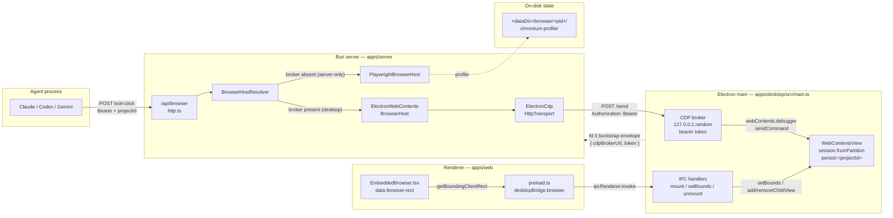
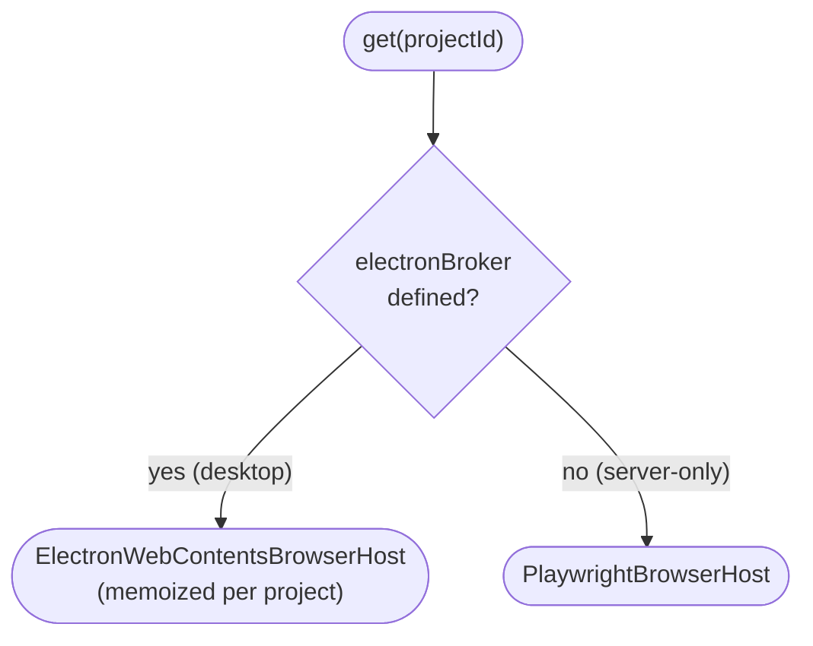
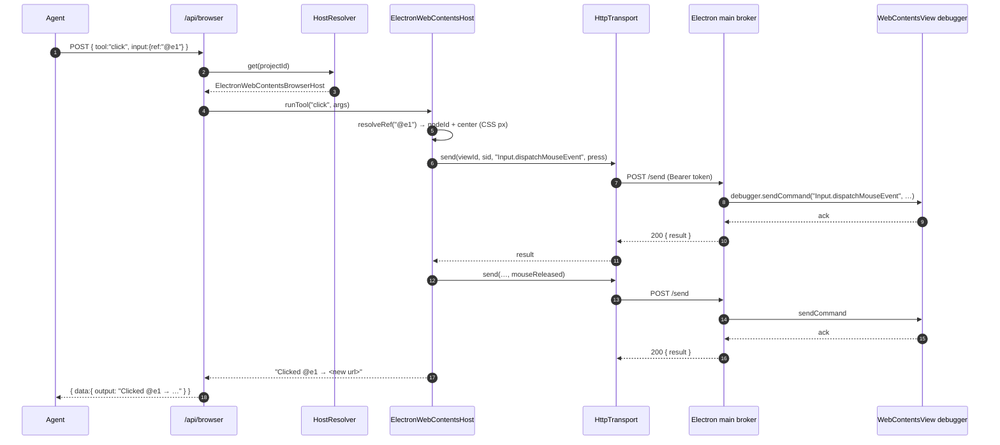
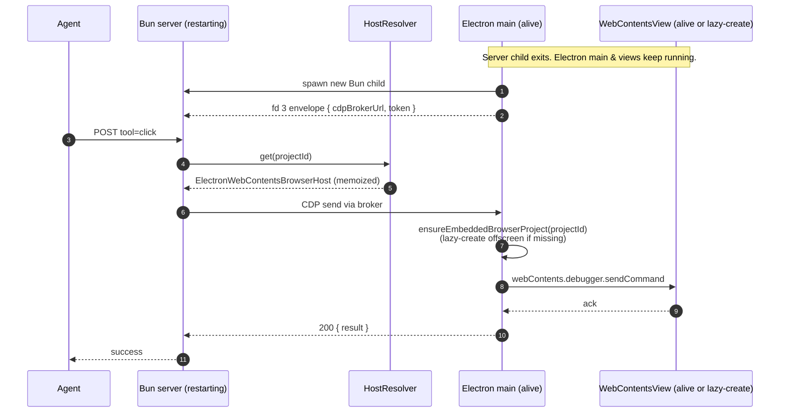
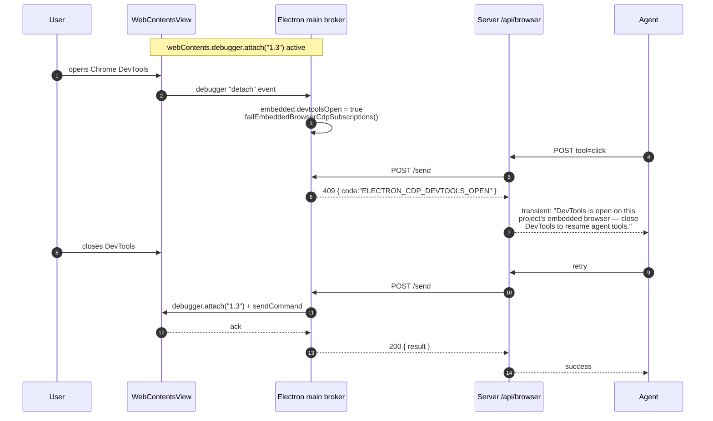

# Browser Automation

In-process Chromium automation exposed to AI sessions via the `/api/browser` REST endpoint. Built by vendoring [GStack Browser](https://github.com/gstack/gstack) (MIT, © Garry Tan) into `apps/server/src/browser/core/` byte-identically, with T3-specific wrappers around it.

See the `NOTICE` file at `apps/server/src/browser/NOTICE` for the full attribution, vendoring approach, and list of intentionally-not-vendored files.

---

## Overview

T3 Code runs Chromium in-process per project. In the desktop runtime each project owns a single, always-on Electron `WebContentsView` (created lazily on first agent CDP request or first user mount, kept alive for the life of the Electron main process). In theoretical server-only deployments — `apps/server` started without `apps/desktop` — projects fall back to a Playwright-managed `launchPersistentContext`. Both hosts share the same per-project Chromium profile dir so cookies, localStorage, and auth sessions survive across restarts. Agents drive whichever host is active through plaintext-returning HTTP commands that use stable `@ref` element identifiers from an accessibility snapshot instead of fragile CSS selectors.

Desktop visibility is decoupled from lifecycle (per [T3CO-421](t3://ticket/T3CO-421)). The renderer owns a URL bar and a `data-browser-rect` sentinel; Electron main mounts the project's already-warm `WebContentsView` over that rect when the user opens the embedded UI, and on close `removeChildView`s it from the visible window and re-parks it in a hidden `BaseWindow` so Chromium keeps compositing it. The `WebContents` and its CDP debugger session stay alive throughout — agents continue to drive the page (including paint-dependent commands like screenshots and PDF) at full speed regardless of whether the embedded UI happens to be open.

Agent calls reach the embedded view through an Electron-main-owned loopback CDP broker. Desktop startup creates a localhost broker with a random bearer token and sends `{ electronCdpBrokerUrl, electronCdpBrokerToken }` to the Bun server in the one-shot bootstrap envelope. The server wraps that endpoint in `CdpBroker`, so `/api/browser` commands for any project drive the corresponding `WebContentsView`. If the project's view doesn't exist yet (cold-start, never mounted), the broker handler creates it offscreen before dispatching. If Chrome DevTools steals `webContents.debugger`, broker calls return the transient DevTools-open error until the debugger reattaches.

| Field             | Value                                                                       |
| ----------------- | --------------------------------------------------------------------------- |
| Endpoint          | `/api/browser`                                                              |
| Auth              | Bearer token (per-thread, `managedRunService.issueMcpAccess`) or dev-bypass |
| Response envelope | `{ data: { message, data: { output: string } }, error: null }`              |
| Total tools       | 58 (navigate, read, interact, snapshot/screenshot, meta, batch)             |
| Desktop host      | Electron `WebContentsView` + `webContents.debugger` CDP (always on)         |
| Server-only host  | Playwright Chromium, `launchPersistentContext`                              |
| Profile dir       | `<dataDir>/browser/<projectId>/chromium-profile/`                           |

## Host selection

`/api/browser` resolves one host per project, decided once at server start by whether the resolver was wired with an Electron CDP broker:

- **Electron `WebContentsView` host** — used for every project in the desktop runtime. The `WebContentsView` is created lazily on first need (first agent CDP call OR first user mount) and stays alive for the life of the Electron main process. Visibility is independent of lifecycle: closing the embedded UI removes the view from the window but keeps the `WebContents` and debugger alive.
- **Playwright host** — used only when the server is started without the desktop process (e.g., headless CI). Owns a persistent Playwright Chromium context under the same `<dataDir>/browser/<projectId>/chromium-profile/` profile directory.

There is no per-project host configuration, no `host.json`, and no recovery window. The decision is made once when the resolver is constructed.

---

## Call pattern

```bash
# Discover tools
curl -s "${BASE_URL}/api/browser?projectId=${PID}&threadId=${TID}" \
  -H "Authorization: Bearer ${TOKEN}"

# Invoke a tool
curl -s -X POST "${BASE_URL}/api/browser?projectId=${PID}&threadId=${TID}" \
  -H "Authorization: Bearer ${TOKEN}" \
  -H "Content-Type: application/json" \
  -d '{"tool":"goto","input":{"url":"https://example.com"}}'
```

Every successful response wraps the command's plaintext output:

```json
{
  "data": { "message": "OK", "data": { "output": "Navigated to https://example.com (200)" } },
  "error": null
}
```

Errors use the standard T3 shape:

```json
{ "data": null, "error": "Unknown tool: totallyFake" }
```

---

## The `@ref` system

The defining feature vs traditional CSS-selector-based automation. `snapshot` returns the accessibility tree with a stable `@e<N>` (interactive element) or `@c<N>` (cursor-interactive — `cursor:pointer`, `onclick`, `tabindex`) identifier per element. Use those refs in follow-up `click`, `fill`, `hover`, `attrs`, `css`, `is`, `screenshot`, `upload` calls.

Refs are invalidated on navigation — re-call `snapshot` after any `goto`, `click`, or `reload` that changes the page.

```json
// 1. snapshot
{"tool":"snapshot","input":{"interactive":true}}
// → "@e1 [link] \"Learn more\""

// 2. click by ref
{"tool":"click","input":{"ref":"@e1"}}
// → "Clicked @e1 → now at https://www.iana.org/help/example-domains"

// 3. re-snapshot (refs invalidated by navigation)
{"tool":"snapshot","input":{"interactive":true}}
```

CSS selectors still work as a fallback for any command that takes a `ref` or `selector` field, but refs are preferred — they survive minor DOM changes and are deterministic across snapshots.

---

## Command inventory

### Navigate

| Tool                        | Purpose                                    |
| --------------------------- | ------------------------------------------ |
| `goto`                      | Navigate to URL, wait for DOMContentLoaded |
| `back`, `forward`, `reload` | History / reload                           |
| `url`                       | Current URL of active tab                  |

### Read

| Tool                           | Purpose                                                                           |
| ------------------------------ | --------------------------------------------------------------------------------- |
| `text`                         | Cleaned visible text (scripts/styles/svg stripped)                                |
| `html`                         | innerHTML of a selector, or full page HTML                                        |
| `links`                        | All links as `text → href`                                                        |
| `forms`                        | Form fields as JSON (passwords + token-shape values redacted)                     |
| `accessibility`                | Raw ARIA tree (no @refs — use `snapshot` for refs)                                |
| `js` / `evaluate`              | Run JS expression, return result as string                                        |
| `eval`                         | Run JS read from a file (path must be safe)                                       |
| `css`                          | Computed CSS value of property on selector                                        |
| `attrs`                        | All attributes of element as JSON                                                 |
| `is`                           | State check: visible / hidden / enabled / disabled / checked / editable / focused |
| `console`, `network`, `dialog` | Captured console / network / dialog buffers                                       |
| `cookies`, `storage`           | Cookies JSON, localStorage+sessionStorage JSON                                    |
| `perf`                         | Page load timing metrics                                                          |
| `inspect`                      | CDP-driven box model + computed styles + matched rules                            |
| `media`                        | Discover ``, `<video>`, `<audio>`, CSS background-image                      |
| `data`                         | JSON-LD, Open Graph, Twitter Cards, meta tags                                     |

### Interact

| Tool                                                        | Purpose                                                                                            |
| ----------------------------------------------------------- | -------------------------------------------------------------------------------------------------- |
| `click`, `fill`, `hover`, `type`, `press`, `scroll`, `wait` | Standard interactions                                                                              |
| `select`                                                    | Dropdown option by value / label / text                                                            |
| `viewport`                                                  | Set viewport size (e.g. `1024x768`)                                                                |
| `cookie`, `cookie-import`, `cookie-import-browser`          | Cookie management (last reads from installed browsers — Chrome, Edge, Brave, Arc, Chromium, Comet) |
| `header`                                                    | Custom request header on future requests (colon-separated)                                         |
| `useragent`                                                 | Override UA (works on Electron host; broken on Playwright host — see known issues)                 |
| `upload`                                                    | Upload file(s) via `<input type=file>`                                                             |
| `dialog-accept`, `dialog-dismiss`                           | Auto-handle next alert/confirm/prompt                                                              |
| `style`                                                     | Live CSS modification via CDP with undo history                                                    |
| `cleanup`                                                   | Remove ads / cookie banners / overlays / clutter                                                   |
| `prettyscreenshot`                                          | `cleanup --all` + screenshot                                                                       |

### Visual / Meta

| Tool                                | Purpose                                                                                                                                   |
| ----------------------------------- | ----------------------------------------------------------------------------------------------------------------------------------------- |
| `snapshot`                          | Accessibility tree with @refs; supports `interactive`, `compact`, `depth`, `selector`, `diff`, `annotate`, `cursorInteractive`, `heatmap` |
| `screenshot`                        | PNG — full page, viewport, clipped, or element; disk path or base64 data URI                                                              |
| `pdf`                               | Export current page as PDF (Electron host uses `webContents.printToPDF`; Playwright host uses `Page.printToPDF`)                          |
| `responsive`                        | Screenshots at multiple viewport sizes                                                                                                    |
| `diff`                              | Unified text diff vs previous snapshot                                                                                                    |
| `tabs`, `tab`, `newtab`, `closetab` | Tab management                                                                                                                            |
| `focus`                             | Bring browser window to front (headed mode only)                                                                                          |
| `status`                            | Connection mode, tab count, active URL                                                                                                    |
| `ux-audit`                          | Heuristic UX/accessibility audit                                                                                                          |

### Batch

`batch` runs up to 50 of the above sequentially in one request. Each entry is `{ tool, input }` — same shape as a top-level POST. Nested `batch` is rejected. Per-entry errors surface as `[N] toolName ERROR: ...` lines in combined output; the overall request still resolves successfully so agents can inspect partial progress.

### Native Day-1 vs Deferred

The Electron host implements the day-1 native surface for navigation, core read commands, core interactions, snapshot/ref commands, screenshots/PDF, tabs, cookies/storage, headers, console/network/dialog buffers, style/cleanup, and status/UX audit.

Three tools are intentionally deferred in native mode and return the standard parity message:

| Tool                    | Reason deferred                                                                                  |
| ----------------------- | ------------------------------------------------------------------------------------------------ |
| `eval`                  | Depends on reading and executing a local file through the Playwright-oriented handler path.      |
| `cookie-import-browser` | Imports cookies from external installed browsers into a Playwright context; needs native review. |
| `responsive`            | Produces multiple viewport screenshots and needs native bounds/DPR-specific behavior.            |

Two tools are permanently unsupported in the embedded host:

| Tool         | Native behavior                                                                                   |
| ------------ | ------------------------------------------------------------------------------------------------- |
| `focus`      | Not meaningful because the native browser already lives inside the Electron app window.           |
| `visibility` | Playwright-only layer command; embedded visibility is controlled by the renderer bounds protocol. |

---

## Architecture

### Cross-process wiring

Four processes cooperate. The renderer owns the browser's on-screen rect; Electron main owns the `WebContentsView` and the CDP broker; the Bun server translates `/api/browser` tool calls into CDP commands; the agent process drives tools over HTTP.



The broker URL and bearer token are generated at Electron startup (`apps/desktop/src/main.ts` — `startBrowserCdpBrokerServer`) and delivered to the Bun child on fd 3 as part of the one-shot bootstrap envelope. The server builds `ElectronCdpHttpTransport` from that URL/token and never talks to Electron any other way. See [browser-transport-decision.md](./browser-transport-decision.md) for why this is an HTTP loopback and not fd framing or `utilityProcess`.

### Server-side dispatch

```
apps/server/src/browser/http.ts            — REST handler, auth, { tool, input } parse
apps/server/src/browser/handlers.ts        — table-driven SPECS, argsFromInput → string[]
apps/server/src/browser/BrowserHostResolver.ts
   │  electronBroker absent  → PlaywrightBrowserHost  (server-only)
   │  electronBroker present → ElectronWebContentsBrowserHost (desktop)
   ▼
BrowserHost.runTool(...)
   ├─ PlaywrightBrowserHost          → BrowserManager → vendored gstack core → Playwright Chromium
   └─ ElectronWebContentsBrowserHost → CdpBroker → Electron main → WebContentsView
```

### Host resolution

`BrowserHostResolver.get(projectId)` is a one-line decision driven entirely by whether the resolver was constructed with an Electron CDP broker. There is no on-disk state, no `host.json`, no recovery window, no per-project configuration. Per [T3CO-421](t3://ticket/T3CO-421) every project in the desktop runtime resolves to the always-on Electron `WebContentsView` host; only theoretical server-only deployments (`apps/server` started without `apps/desktop`) ever fall back to Playwright.



Implementation: `apps/server/src/browser/BrowserHostResolver.ts`. The Electron host is memoized per project so `@ref` maps, snapshot/console/network/dialog buffers, and CDP subscriptions survive between HTTP requests (T3CO-350).

### Bounds protocol (renderer ↔ main)

The renderer is the source of truth for the browser's on-screen rect. `EmbeddedBrowser.tsx` renders a `data-browser-rect` DOM sentinel and calls `getBoundingClientRect()` on mount, resize, and layout change. The preload bridge (`apps/desktop/src/preload.ts`) exposes project-scoped IPC channels:

| Channel                      | Renderer call                          | Main handler                                                                                                                         |
| ---------------------------- | -------------------------------------- | ------------------------------------------------------------------------------------------------------------------------------------ |
| `BROWSER_MOUNT_CHANNEL`      | `browserBridge.mount(pid, bounds)`     | retrieve the project's always-on `WebContentsView` (lazy-create offscreen if needed), `setBounds`, `window.contentView.addChildView` |
| `BROWSER_SET_BOUNDS_CHANNEL` | `browserBridge.setBounds(pid, bounds)` | `.setBounds(bounds)` on the project-scoped active view                                                                               |
| `BROWSER_UNMOUNT_CHANNEL`    | `browserBridge.unmount(pid)`           | project-scoped `removeChildView` + re-park view in the offscreen `BaseWindow` host + pause media (view stays alive and composited)   |
| `BROWSER_GET_URL_CHANNEL`    | `browserBridge.getUrl(pid)`            | read the project-scoped active tab URL                                                                                               |
| `BROWSER_LIST_TABS_CHANNEL`  | `browserBridge.listTabs(pid)`          | summarize project-scoped tabs                                                                                                        |
| `BROWSER_NAVIGATE_CHANNEL`   | `browserBridge.navigate(pid, url)`     | navigate the project-scoped active tab                                                                                               |
| `BROWSER_NEW_TAB_CHANNEL`    | `browserBridge.newTab(pid, url?)`      | open a project-scoped tab                                                                                                            |
| `BROWSER_SWITCH_TAB_CHANNEL` | `browserBridge.switchTab(pid, tabId)`  | switch project-scoped tabs                                                                                                           |
| `BROWSER_CLOSE_TAB_CHANNEL`  | `browserBridge.closeTab(pid, tabId)`   | close a project-scoped tab                                                                                                           |

The view is cached per project for the life of the Electron main process — unmount removes it from the visible window and re-parks it in the offscreen `BaseWindow` host (see the "Always-on per project" and "Offscreen `BaseWindow` parking" key design decisions below) so cookies, scroll position, JS state, AND the Chromium compositor all survive toggling. Every post-mount renderer IPC call includes the expected project id; Electron main ignores stale calls when that id no longer matches the window's active embedded-browser project. This prevents delayed bounds, unmount, URL, tab, or navigation requests from a previous project from attaching or reading the newly active project's browser surface. See `apps/desktop/src/main.ts` around the `BROWSER_*_CHANNEL` handlers, `createEmbeddedBrowserTab`, and `parkEmbeddedBrowserView` for the lifecycle.

### Hidden-view media pause

When a view is hidden (project swap, toggle off, or unmount), Electron main sends a `Runtime.evaluate` that pauses every `<video>` and `<audio>` element on the page. This is **immediate** and unconditional — the moment the user closes the browser pane, audible media stops. The CPU is **not** throttled at this point; agent `/api/browser` calls run at full speed. The implementation is `pauseEmbeddedBrowserMedia` in `apps/desktop/src/main.ts`.

Distinct from idle suspension (next subsection): media pause fires on UI hide; idle suspension fires after a long inactivity timeout. Both can apply to the same hidden view.

### Idle suspension

After a configurable period of inactivity (default 30 min), an unmounted project's `WebContentsView` is suspended: Electron main calls `webContents.setBackgroundThrottling(true)` and `setAudioMuted(true)` on every tab in the project. The `WebContents`, debugger session, and offscreen-host parking remain intact — only Chromium-internal compositing/timer rates and audio output are affected. Resume is automatic on the next agent CDP call, user mount, or page event.

Activity signals tracked: incoming CDP broker requests, `BROWSER_MOUNT_CHANNEL` / `BROWSER_UNMOUNT_CHANNEL` IPC, `did-finish-load`, and `before-input-event`. Visible (`mounted: true`) projects are never candidates for suspension.

Configured via Settings → Browser → "Suspend idle browsers after [N] min". `0` disables suspension. Setting changes are picked up by the next sweep (≤ 60s).

Implementation: `runEmbeddedBrowserIdleReaperSweep`, `markEmbeddedBrowserActive`, `suspendEmbeddedBrowserProject`, and `resumeEmbeddedBrowserProject` in `apps/desktop/src/main.ts`. The pure decision rule is `shouldSuspendForIdle` in `apps/desktop/src/embeddedBrowserIdleReaper.ts`. See [T3CO-422](t3://ticket/T3CO-422).

### Key design decisions

- **Vendored code is byte-identical to upstream.** The `core/**` directory is excluded from T3's typecheck (DOM globals + `exactOptionalPropertyTypes` + strict null make gstack fail T3's compiler settings). `handlers.ts` bridges with dynamic `import("./core/...ts")` calls at runtime and declares minimal local interfaces for the vendored types it touches.
- **Composition, not modification.** Per-project Chromium profiles, T3-scoped data directories, and the REST surface live in T3-authored files outside `core/`. Never edit vendored files — pull-up cost would be paid on every gstack refresh.
- **Plaintext output.** Every command returns plaintext, not structured JSON. Agents read output directly; the envelope is only for transport. This saves ~2k tokens per command vs typical JSON-framed MCP tool output.
- **Bun production runtime.** The vendored `cookie-import-browser.ts` imports `bun:sqlite` at module load time. Rather than shim that, T3 runs `apps/server` under Bun in production (T3 already depends on `@effect/sql-sqlite-bun`). Tracked at [T3CO-328](t3://ticket/T3CO-328) for the `package.json` `start` script flip.
- **CDP broker instead of remote debugging port.** Electron main exposes only a bearer-protected loopback broker to the child server. There is no public `--remote-debugging-port`; the bootstrap envelope passes the random broker URL/token.
- **Always-on per project ([T3CO-421](t3://ticket/T3CO-421)).** Each project's `WebContentsView` is created lazily on first need — either the user opens the embedded UI or an agent issues a CDP request — and stays alive for the life of the Electron main process. Visibility (mounted in a window) is independent of lifecycle (process exists). Closing the embedded UI removes the view from the window but keeps the `WebContents` and its debugger session intact, so agents continue to drive the browser without interruption. There is no `host.json`, no recovery window, no sticky host assignment.
- **Offscreen `BaseWindow` parking.** Chromium suspends the compositor for any `WebContentsView` that is not attached to some window's `contentView`, which makes paint-dependent CDP commands (`Page.captureScreenshot`, `Page.printToPDF`, media extraction, annotated snapshots) return blank or hang. To keep the always-on contract honest for hidden projects, every embedded view that is not currently mounted in a real `BrowserWindow` is parented to a single hidden `BaseWindow` (`show: false`, offscreen position, `skipTaskbar`). On UI mount the view moves into the real window via `addChildView`; on unmount, tab switch, project switch, and modal suspend it is re-parked in the offscreen host. Implementation: `ensureOffscreenBrowserHost` and `parkEmbeddedBrowserView` in `apps/desktop/src/main.ts`.
- **Idle suspension ([T3CO-422](t3://ticket/T3CO-422)).** Always-on does not mean always-paying. After a configurable idle period (default 30 min, configurable via Settings → Browser, `0` disables), an unmounted project is suspended via `webContents.setBackgroundThrottling(true)` and `setAudioMuted(true)`. The `WebContents`, debugger session, and offscreen parenting are preserved; only compositing rates and audio output drop. Activity signals (CDP broker, mount/unmount IPC, `did-finish-load`, `before-input-event`) immediately resume the view with no agent-visible error. Visible projects are never candidates. The reaper runs once per minute and reads the threshold from `settings.json` on each sweep, so changes take effect without a restart.

### Per-project profiles

Profile directory layout (production — `~/.t3/userdata/browser/<projectId>/chromium-profile/`):

```
Cookies                      Cache                       GPUCache
Cookies-journal              Code Cache                  Local Storage
PersistentOriginTrials       DIPS                        ...
```

The BrowserManager layer lazy-launches a persistent context on the first `acquire(projectId)` call and holds it in a `Map<ProjectId, BrowserContext>`. Contexts are closed (not deleted on disk) after 30 minutes of idle time, and a fresh launch restores all persistent auth state from the profile dir. A project's Chromium crash evicts only that project's context — other projects keep running.

Dev server: paths resolve under `~/.t3/dev/browser/<projectId>/...` when `ServerConfig.devUrl` is set (Electron dev mode), otherwise `~/.t3/userdata/browser/<projectId>/...`.

Native embedded profiles live inside Electron's own `persist:<projectId>` partition storage, separate from but co-located with the Playwright profile dir under `<dataDir>/browser/<projectId>/`. Because the partition name embeds the canonical project id, any future project import/merge flow that rewrites ids must migrate the Electron partition as well.

### Retina / DPR

All browser tool coordinates are CSS pixels. The Electron host normalizes CDP details internally: `DOM.getBoxModel` and `Input.dispatchMouseEvent` use CSS pixels, while `Page.captureScreenshot` returns device pixels. Screenshot output remains the familiar browser-tool payload, and any future coordinate-to-screenshot correlation must keep the `devicePixelRatio` multiplier in mind on Retina displays.

### DevTools Conflict Policy

Electron allows only one `webContents.debugger` client per `WebContents`. When the user opens Chrome DevTools on the embedded browser, Electron detaches T3's debugger. While detached, native `/api/browser` calls fail with a clear transient error asking the user to close DevTools; Electron then reattaches and agent tools resume. Native Chrome DevTools coexistence is not planned for this host. A future T3-owned DevTools panel should use the same `CdpBroker` rather than competing for the debugger client.

### Extension Support

Extensions are host-scoped. `session.loadExtension(path)` attaches to an Electron `Session`, so loaded extensions apply only when the project is Electron-authoritative. Playwright projects do not see Electron-loaded extensions, and full extension management UI must gate on host kind.

The Phase 4 smoke audit used `scripts/embedded-browser-extension-audit.cjs` against Electron 40.6.0:

- MV2 content-script extension loaded with the expected deprecation warning; its JS injected and its CSS hiding rule applied.
- MV3 extension loaded; content script messaged the service worker successfully; `chrome.runtime`, `chrome.storage.local`, `chrome.tabs.query`, `chrome.scripting.executeScript`, and `chrome.action` were present in the tested contexts.
- The MV3 action popup was directly loaded in a hidden Electron `BrowserWindow` at its `chrome-extension://<id>/popup.html` URL. It rendered successfully, messaged the service worker, and `chrome.tabs.query({ active: true, currentWindow: true })` returned the active audit page tab.
- No interactive permission prompts surfaced during install, content-script injection, service-worker messaging, or popup rendering; permissions came from the manifest. The current embedded UI still has no native toolbar/action affordance, so user-invoked popup UI remains future extension-management work.

### Chromium bundle

Playwright's Chromium binary is shipped inside the packaged desktop app rather than downloaded on first launch. The build script (`scripts/build-desktop-artifact.ts`) runs `bunx playwright install chromium` with `PLAYWRIGHT_BROWSERS_PATH` pointing at a staged directory, which electron-builder then copies into `Resources/playwright-browsers/` via `extraResources`. At runtime, `backendChildEnv()` in `apps/desktop/src/main.ts` sets `PLAYWRIGHT_BROWSERS_PATH` to that directory before spawning the backend, so Playwright finds the bundled copy.

Runtime install is not supported: `playwright/cli.js` is unresolvable from inside `app.asar.unpacked` under the Bun runtime, and a lazy 200 MB download on first use is user-hostile anyway. If the bundled copy is missing, `assertChromiumAvailable` in `BrowserManager.ts` logs a clear diagnostic at startup and the first `goto` fails loudly.

Dev builds leave `PLAYWRIGHT_BROWSERS_PATH` unset, so Playwright uses the developer's `~/Library/Caches/ms-playwright/` install (`bunx playwright install chromium` once per machine).

---

## Sequence diagrams

### Agent click on a desktop project

Two CDP commands per click — `mousePressed` then `mouseReleased` — each a separate broker round-trip. Ref resolution happens once on the server side before any CDP traffic, so a stale `@ref` fails fast without hitting Electron.



### Server restart recovery

Electron main and every `WebContentsView` survive a Bun server restart. The new server child reads the broker URL and token from the fd 3 bootstrap envelope, and `/api/browser` works immediately — there is no per-project recovery state machinery to wait on. Per [T3CO-421](t3://ticket/T3CO-421) the resolver returns the always-on Electron host on every call when a broker is wired, so the first agent request after restart succeeds without retries. If the request targets a project whose `WebContentsView` has not yet been created (cold start, never mounted), the CDP broker handler in Electron main creates it offscreen on demand before dispatching. See [startup-recovery.md](./startup-recovery.md) for the broader restart story.



### DevTools conflict and reattach

Electron allows only one `webContents.debugger` client per `WebContents`. When the user opens Chrome DevTools on the embedded browser, the OS-level DevTools takes the slot and Electron fires `detach` on T3's debugger. `/api/browser` calls for that project return a 409 with code `ELECTRON_CDP_DEVTOOLS_OPEN` and a human-readable message until DevTools closes; the next `sendCommand` call transparently reattaches.



---

## Known issues

- **`useragent`** (Playwright host only) — calls the vendored `recreateContext()`, which assumes `this.browser !== null`. Under `launchPersistentContext` there is no separate Browser object, so the call crashes and resets the active tab to `about:blank`. Tracked at [T3CO-331](t3://ticket/T3CO-331). Avoid on the Playwright host; works end-to-end in the Electron embedded host (`Network.setUserAgentOverride` via CDP).

## JavaScript dialog handling (Electron host)

`alert()`, `confirm()`, and `prompt()` on the embedded `WebContentsView` would, by default, render a Chromium-native window-modal dialog attached to the owning BrowserWindow — blurring the entire T3 Code UI (chat input, sidebars, everything), not just the webview region. The CDP `Page.javascriptDialogOpening` event does not fire reliably through our broker before the native modal appears, so an out-of-band CDP handler can't intercept in time.

The Electron host addresses this with two layers:

1. **`webPreferences.disableDialogs: true`** on the `WebContentsView` — Chromium's native dialog path is suppressed entirely. No window-modal, no UI block.
2. **Page-side override** installed via `Page.addScriptToEvaluateOnNewDocument` on every new document. The shim replaces `window.alert/confirm/prompt` with functions that:
   - Push a record into `window.__t3_captured_dialogs[]` (with type, message, timestamp, and the `handled` outcome actually applied).
   - Read `window.__t3_dialog_policy` to decide the synchronous return value.
   - Reset `window.__t3_dialog_policy` to the accept default after each call (one-shot).

`dialog-accept [text]` and `dialog-dismiss` write the new policy to the page via `Runtime.evaluate` immediately before returning, so the next dialog-triggering interaction sees the intended value. `dialog` drains the page-side buffer (also via `Runtime.evaluate`) on demand and merges into the server's dialog history; drains must happen before navigation, or not-yet-drained entries on the old document are lost.

This uses `Runtime.evaluate` (command channel) and sidesteps `Runtime.addBinding` + `Runtime.bindingCalled` because Runtime event subscriptions are not currently delivered through our Electron debugger broker — see [T3CO-7](t3://ticket/T3CO-7). Tracked as [T3CO-2](t3://ticket/T3CO-2).

---

## Related tickets

- [T3CO-318](t3://ticket/T3CO-318) — parent epic
- [T3CO-319](t3://ticket/T3CO-319) — vendor GStack browser code
- [T3CO-320](t3://ticket/T3CO-320) — Playwright lifecycle layer
- [T3CO-321](t3://ticket/T3CO-321) — REST endpoint scaffolding
- [T3CO-322](t3://ticket/T3CO-322) — walking-skeleton commands
- [T3CO-323](t3://ticket/T3CO-323) — full command port
- [T3CO-324](t3://ticket/T3CO-324) — browser admin prompt
- [T3CO-325](t3://ticket/T3CO-325) — integration tests
- [T3CO-328](t3://ticket/T3CO-328) — Bun production runtime switch (deferred)
- [T3CO-329](t3://ticket/T3CO-329) — Chromium auto-install (superseded: Chromium is bundled at build time; see "Chromium bundle" below)
- [T3CO-330](t3://ticket/T3CO-330) — headed/headless UX (deferred)
- [T3CO-331](t3://ticket/T3CO-331) — fix `useragent` under persistent context (deferred)
- [T3CO-333](t3://ticket/T3CO-333) — port pure-logic vendored tests (deferred)

---

## Debugging

| Symptom                                            | Check                                                                                                                                                                                                                                      |
| -------------------------------------------------- | ------------------------------------------------------------------------------------------------------------------------------------------------------------------------------------------------------------------------------------------ |
| `Executable doesn't exist at .../chromium/chrome`  | Dev: run `bunx playwright install chromium` once per machine. Packaged app: the Chromium bundle is shipped in `Resources/playwright-browsers/`; if it's missing the build was incomplete — reinstall the app. See "Chromium bundle" above. |
| `Context recreation failed: null is not an object` | `useragent` crash — see known issues above.                                                                                                                                                                                                |
| Cookies missing after restart                      | Verify profile dir exists at `<dataDir>/browser/<projectId>/chromium-profile/Default/Cookies`. Session cookies (no `max-age`) don't persist; that's per-spec.                                                                              |
| `Ref @e3 not found`                                | Snapshot is stale. Re-call `snapshot` after any navigation.                                                                                                                                                                                |
| Agent doesn't know the endpoint exists             | Settings → Prompts → Browser — confirm the admin prompt is enabled (it's a shipped default). Also check the `## T3 Browser Automation` block is present in the rendered system prompt for the failing session.                             |
