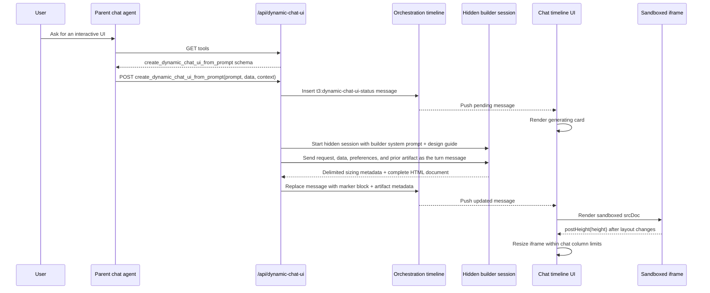

# Dynamic Chat UI

Dynamic Chat UI lets a chat agent ask T3 to generate an interactive interface and insert it directly into the chat timeline as a durable message. The parent agent does not write HTML itself. It calls a single REST tool, and T3 starts a hidden builder session using the same model selection as the visible chat thread.

The feature is intentionally highly dynamic. Generated UIs are self-contained HTML/CSS/JS documents rendered in sandboxed iframes inside chat messages.

## Goals

- Let agents respond with useful UI when prose is a poor fit: tables, calculators, dashboards, charts, simulators, controls, comparisons, and visual status cards.
- Keep generated UIs visually aligned with T3 Code through the Dynamic UI design guide.
- Persist generated UIs as part of the chat timeline, including across reloads and thread revisits.
- Support follow-up edits by resuming the hidden builder session when possible and by providing the previous artifact HTML as context.
- Keep the parent agent API small: expose only `create_dynamic_chat_ui_from_prompt`.

## User Experience

When the agent calls the tool, T3 inserts a compact generating card into the current chat timeline. When the builder finishes, the same timeline message is replaced by a `t3:dynamic-chat-ui` artifact block. The web app parses that block and renders it as a sandboxed iframe.

The iframe is part of the timeline, not a transient overlay. It scrolls with the conversation, survives chat rerenders, and is reconstructed from message content if the thread is reopened later.

Follow-up requests such as "make the chart stacked" or "remove the extra panel" should generate a revised artifact by calling the same tool with `sourceArtifactId` and, when known, `sourceMessageId`.

## Agent Tool Surface

The parent chat agent receives only the Dynamic UI REST endpoint and the `create_dynamic_chat_ui_from_prompt` tool.

The parent agent should pass:

- `prompt`: the user's UI request.
- `data`: optional structured data the UI should render, calculate from, or simulate.
- `context`: optional short product/domain context.
- `sourceArtifactId`: the existing artifact id for revisions.
- `sourceMessageId`: the assistant message id containing the artifact, useful when multiple revisions exist.
- `title`: required short artifact title shown immediately in the generating card.
- `description`: required brief description of what is being built, shown immediately in the generating card.
- `initialHeight`: optional first-paint height preference. The iframe autosizes after render.

The parent agent should not:

- Generate HTML itself.
- Print the returned HTML, JSON, or artifact block.
- Ask for example templates before calling the tool.
- Call any lower-level Dynamic UI artifact creation function.

Requests missing `title` or `description` are rejected before T3 inserts a pending timeline message.

## Builder Session

`apps/server/src/dynamicChatUi/http.ts` owns the builder flow:

1. Validate the REST tool call and authenticate it against the source thread.
2. Resolve the source thread and selected model.
3. Clamp impractical reasoning settings, for example Claude or Codex `xhigh`/`max`/`ultra` to `high`.
4. Load the Dynamic UI builder prompt and design guide from Settings overrides or shipped defaults.
5. Find the previous artifact when this is a revision.
6. Insert a pending timeline message.
7. Start or resume the hidden builder provider session.
8. Parse delimiter-based builder output.
9. Replace the pending message with a durable artifact block.

Builder thread ids are deterministic per source thread and artifact id:

```text
dynamic-chat-ui-builder-<sha256(sourceThreadId:artifactId).slice(0, 24)>
```

That stable id lets T3 reuse provider session resume behavior for follow-up revisions. If a provider can no longer resume the hidden session, the server still passes the previous artifact HTML into the new prompt.

## Data Flow



For a revision, the parent agent calls the same tool with `sourceArtifactId`. The server locates the prior artifact, includes its metadata and HTML in the builder prompt, and uses the same artifact id unless the parent explicitly requests a new one.

## Artifact Format

Generated messages contain a small fenced marker block, while the full iframe HTML is stored in message metadata:

````markdown
```t3:dynamic-chat-ui
{
  "version": 1,
  "id": "chat-ui-...",
  "title": "Incident dashboard",
  "description": "Interactive outage dashboard.",
  "initialHeight": 420,
  "maxHeight": 700
}
```
````

`metadata.dynamicChatUiArtifacts` stores the renderable artifact document, including `html`. Older messages that still contain full HTML in the fenced block are parsed as a legacy fallback.

## Rendering Model

`apps/web/src/components/chat/DynamicChatUiArtifact.tsx` renders artifacts.

Generated HTML runs in an iframe with scripts enabled and without same-origin access. The web app injects T3 CSS variables and a small bridge:

- `window.t3ChatUi.postHeight(height)` lets the artifact request a new iframe height.
- A resize observer measures content and posts height updates.
- Heights are not capped by artifact metadata. The parent ignores tiny resize jitter, but otherwise lets the iframe grow or shrink to the measured content height.
- The chat column can resize up to roughly 800px; generated UIs must work at 320px, 520px, and 800px widths.

To prevent expensive iframe resets during chat rerenders, the web app keeps live iframe nodes in a small parking-lot cache and reattaches them by artifact id/content hash. This preserves UI state while the timeline rerenders.

## Builder Prompt, Design Guide, And Settings

The builder consumes two editable Settings values:

- `Builder Prompt`: the wrapper prompt sent to the hidden builder model as provider-level instructions. It contains the delimiter contract, iframe constraints, output requirements, and placeholders for the request, data, prior artifact, and design guide. Editing this stores `settings.dynamicChatUi.builderPromptOverride`.
- `Design Language`: the design guide. By default this is `docs/design-language.md`, especially the Dynamic Chat UI section. Editing this stores `settings.dynamicChatUi.designGuideOverride`.

Settings -> Prompts includes a Dynamic UI section that shows both effective values. Reset clears the matching override and returns to the bundled original content.

The builder prompt must preserve its `{{...}}` placeholders and delimiter contract. If a customized builder prompt omits required placeholders, `/api/dynamic-chat-ui` rejects generation before inserting a pending timeline message.

## Admin Prompt

Settings -> Prompts -> Admin Prompts includes `Dynamic Chat UI`. This is the system prompt injected into visible chat sessions that tells the parent agent when and how to call the Dynamic UI tool.

The admin prompt should describe parent-agent behavior only. The detailed visual constraints belong in the design guide consumed by the hidden builder. Keeping those responsibilities separate avoids wasting tokens in the visible chat session and keeps the parent agent from over-constraining generation.

## Security And Isolation

Dynamic UI artifacts are deliberately expressive, but they remain isolated:

- Generated documents are sandboxed iframes.
- They cannot access the parent origin.
- They cannot load external network resources.
- They must inline all CSS and JavaScript.
- They communicate layout changes only through the injected height bridge.

The current feature is not a safe plugin marketplace. Treat it as an experimental local dynamic UI capability.

## Operational Notes

- The parent REST tool returns metadata, model information, builder thread id, and design guide source.
- Builder timeout is intentionally long because full UI generation can take minutes on high-capability models.
- Failures replace the pending card with a failure message so the chat timeline does not stay stuck.
- Existing artifacts are durable because the final HTML is stored in message metadata and legacy full-HTML marker blocks are still supported.
- New design-guide edits apply only to future generations or future revisions.

## Tests

Core coverage lives in:

- `apps/server/src/dynamicChatUi/http.test.ts`
- `apps/web/src/components/ChatMarkdown.test.tsx`
- `apps/web/src/lib/dynamicChatUiParser.test.ts`
- `apps/web/src/components/settings/PromptsPanel.browser.tsx`
- `packages/shared/src/dynamicChatUi.test.ts`

Before completing work on this feature, run:

```bash
bun fmt
bun lint
bun typecheck
```
